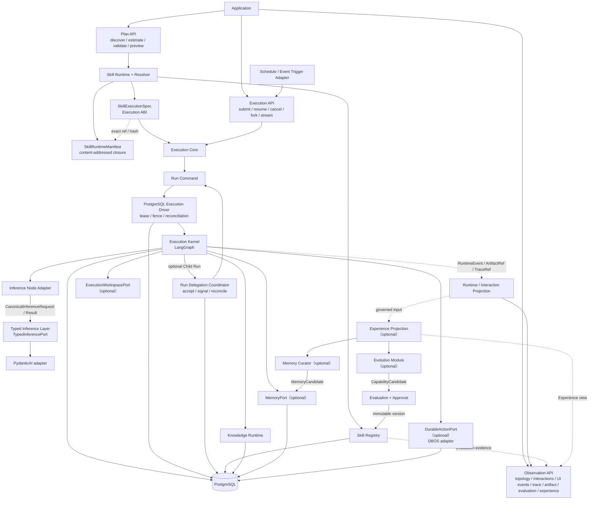
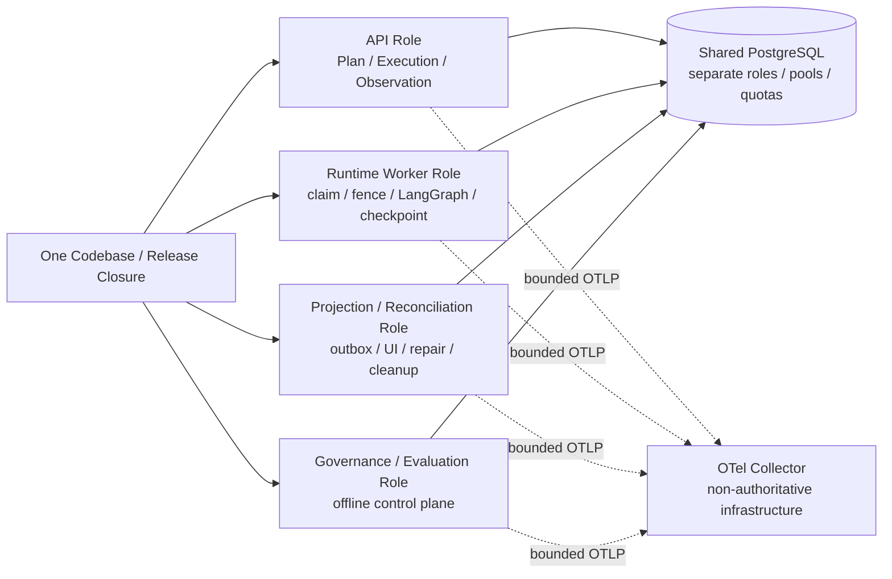

# GROVE Architecture

> Governed Runtime for Observable, Versioned Execution
> 架构集版本：GROVE v1.0
> 状态：Architecture Baseline / Pre-POC / Documentation Index
> 更新日期：2026-08-02

## 0. 文档边界

本文负责平台边界、状态所有权、Capability Profile 和文档地图，不复制专题
协议。规范归属和阅读路径见仓库 [README](../README.md)。

前身 EAR v1.0 已移入 `docs/archive/`，仅用于解释历史决策；其中
`ExecutionPlan`、mutable `ExecutionContext`、pydantic_graph Kernel 和 arq
worker 均不是现行概念。

### 0.1 决策粒度

架构集只把以下内容提升为跨系统决策：模块边界、状态所有权、trust seam、稳定协议、
兼容规则、Capability/Business Profile 关系和演进触发器。具体业务字段、局部数量
上限、错误文案、adapter 查询实现与压测所得参数由对应 Profile、Manifest 和
`docs/90` evidence 管理，不反向扩张 Core。

量化值必须由 golden dataset、边界测试或目标环境 POC 产生，再冻结进 versioned
artifact；架构文档不得提供未经验证的隐式默认值。缺少量化证据只保持对应 release
gate 为 open，不重新打开已经确定的模块边界。

### 0.2 命名约定

- 产品和项目统一称为 **GROVE**：`Governed Runtime for Observable, Versioned Execution`。
- 命名收敛后的架构版本从 **GROVE v1.0** 重新起算，不与历史 EAR/EAP 版本号混用。
- 对外产品入口称为 **Platform API**，内部在线执行模块称为 **Execution Core**。
- Skill Framework 与 Execution Core 之间的稳定边界称为 **Execution ABI**。
- Telemetry span 使用 `grove.*`，环境变量使用 `GROVE_*`，服务、镜像和部署资源
  使用 `grove-` 前缀；领域 contract/event 继续使用语义名称，不强制品牌前缀。
- EAR、EAP 和 Agent OS 只允许出现在历史归档或迁移说明中，不能进入新 contract、
  module、API 或配置名。

## 1. 一句话架构

> **Skill Framework 管理企业业务能力资产；LangGraph 是 GROVE 唯一
> Execution Kernel；PydanticAI 降级为无状态 Typed Inference Layer；
> Knowledge Runtime 提供受治理知识；Memory、Execution Workspace 和
> Durable Action 按 Profile 启用；GROVE 对外分为 Plan、Execution、
> Observation 三类 API；
> Sub-agent、Swarm 和 GoalLoop 只形成 LangGraph 图拓扑；Experience 与
> Evolution 在执行之外离线演化候选能力。**

“GROVE”是产品边界，不是新的部署服务。
不在 GROVE 之上再实现一个 Agent Kernel。

## 2. 核心原则

1. Agent 是 Skill Composition + Policy 的场景配置，不是 Capability。
2. Plan、Execution、Observation 分离；不存在万能 Agent Runtime API。
3. 一个执行单元只能有一个持久化与恢复所有者。
4. `SkillExecutionSpec` 是 Skill Framework → Execution Core 的 Execution ABI。
5. Skill 必需 capability 缺失时 fail fast，禁止静默降级。
6. 已启动 run 固定 `SkillExecutionSpec`，不得解析到 `latest`。
7. Memory 不是 Knowledge；流程方法属于 Skill/Policy，不属于 Memory。
8. Experience 是可重建投影，不是统一恢复 Event Store。
9. Evolution 只生成 Candidate，不能直接修改 active capability。
10. 在线执行不依赖 Memory、Experience 或 Evolution consumer 才能恢复。
11. PostgreSQL 是默认基础设施；可选 Profile 不得反向成为 Execution Core 依赖。
12. PydanticAI 不拥有 graph、executable business Tool loop、Memory、
    checkpoint、interrupt、durability 或 Agent Run lifecycle。
13. Canonical Execution Contracts 是不可变 typed messages，不是新的
    ExecutionContext、State 副本或通用 Graph IR。
14. PostgreSQL Execution Driver 只负责可靠唤醒、单写者租约和故障接管；
    LangGraph 仍是 graph state 与 lifecycle 的唯一所有者。
15. replay、fork dry-run 和 fork commit 都创建新的 Agent Run；禁止原地把
    无副作用 run 提升为可写 run。
16. Sub-agent、Swarm 和 GoalLoop 不是新的 Runtime；默认在同一 run 内通过
    subgraph、`Send`、reducer 和 bounded loop 表达。
17. 只有需要独立 lifecycle 的委派才创建 Child Run；父子 run 通过可选
    `run.delegation` capability 和 internal Run Signal 协作。
18. schedule/event trigger 只通过普通 submit 创建新 run；不能旁路
    Execution Driver 直接执行 Graph。
19. 身份租户、可靠异步执行、契约版本、观测审计、可靠交互、资源边界、评测
    证据和最小生产运维共同构成不可关闭的 MVP Foundation。
20. RuntimeEvent/Audit Fact 不可采样但不拥有执行状态；OTel telemetry 允许
    有界丢失且故障不能影响 Agent Run。
21. Core Release 不预设 Business Profile；Product MVP 必须显式绑定精确领域闭环并
    通过该 Profile 的 G3，参考 Profile 不能成为隐式默认值。

### 2.1 AgentScope 借鉴范围

AgentScope 作为实现参考，不成为运行依赖，也不改变上述模块所有权：

| 借鉴点 | GROVE 决策 | 落点 |
|---|---|---|
| typed UI events / projector | 采用 closed union + 可重建 Interaction Projection | Observation / Canonical / Frontend |
| permission presets | 采用四个 versioned posture；只决定已授权 operation 的 AUTO/ASK/DENY，无 bypass | SkillExecutionSpec PermissionBinding |
| continuation summary | 采用结构化摘要 + recent tail + source refs；显式 Graph node 原子 checkpoint | Working Memory |
| memory | 采用分类、排除项和小上下文；recall/write 仍由 Graph/candidate governance 控制 | Knowledge and Memory |
| role template / HITL | RoleTemplate 只编译现有 delegation；Child HITL 镜像到 Parent inbox，Child checkpoint 权威 | Multi-Agent / Observation |
| middleware ergonomics | 适配为固定 Observer/Transformer/Guard chain，只开放 adapter/projector seam | Runtime Build / Integration |
| general mailbox | MVP Baseline 延后；completion、HITL、Action、Trigger 继续使用各自权威协议 | Multi-Agent async routing |

明确不借鉴：middleware 持有 mutable Agent/State、自动 Memory 直写、
drain-on-read mailbox、自由 `name + dict` UI event、permission bypass，以及隐藏在
middleware 中的 context compression/delegation。

## 3. 三个平台核心

| 核心                          | 定义                              | 长期作用                                                        |
| ----------------------------- | --------------------------------- | --------------------------------------------------------------- |
| `SkillExecutionSpec`           | Execution ABI / Execution Snapshot | 定义一次运行采用的完整、不可变环境                                  |
| Canonical Execution Contracts  | 平台内部 Protocol            | 隔离 Kernel、Inference、Knowledge、Memory、Action 和 Experience     |
| Skill Governance + Evolution   | Release Gate + optional Growth    | 证明并发布 Skill；可选地把 Experience 转化为经过门禁的新 Candidate |

LangGraph 是已选定、需显式迁移才能替换的 Kernel；PydanticAI 和 DBOS
分别位于可替换 inference/action seam。三类稳定资产回答“运行什么”、
“如何通信”和“如何受治理地变强”。

```text
Execution
  → governed Experience
  → Evaluation / Candidate
  → Approval
  → immutable New Skill Version
  → only future Execution
```

在线 Kernel 不依赖 Growth Engine 才能完成或恢复。

### 3.1 GROVE 四层模型

```text
Capability Layer
  └─ Skill Framework

Execution Layer
  └─ Execution Core / LangGraph Execution Kernel

Context Layer
  ├─ Knowledge Runtime
  └─ optional MemoryPort

Evolution Layer
  └─ Experience / Evaluation / Evolution / Publication
```

第三层使用 `Context Layer`，避免把非权威 Memory 与 authoritative
Knowledge 合并成同一概念。Experience 是从 Runtime facts 派生的数据资产，
Memory 与 Evolution 只消费 governed Experience，不直接读取 framework
Runtime 内部状态。

## 4. 总体架构



在线调用链：

```text
Plan API
  → SkillRuntime.discover()/resolve()
  → estimate / validate / side-effect-free preview

Execution API.submit()
  → re-resolve + reauthorize
  → immutable SkillExecutionSpec
  → persist Agent Run + start command
  → PostgreSQL Execution Driver claims command and obtains fence
  → LangGraphExecutionKernel.run()
       ├─ Workspace lifecycle node acquire() [optional]
       ├─ InferenceNodeAdapter
       │    └─ TypedInferencePort.infer(canonical_request)
       ├─ KnowledgePort.retrieve()
       ├─ MemoryPort.recall()/record()       [optional]
       ├─ Tool node uses WorkspaceHandleRef  [optional]
       ├─ DurableActionPort.submit()         [optional]
       ├─ RunDelegationCoordinator.accept()  [optional]
       └─ Workspace lifecycle node release() [optional]
  → reconciliation releases orphan workspace [optional]

Observation API
  → Runtime / Topology / Interaction / Trace / Artifact / Evaluation / Experience projections
```

`resume/cancel/fork` 使用相同 command path、idempotency 和 optimistic
revision。除 inspect 外，replay/fork 都创建新 run；Driver 只投递 Kernel
invocation，不决定 graph route。

同一 run 内的 Sub-agent、Swarm 和 GoalLoop 直接使用 LangGraph subgraph、
`Command`、`Send`、reducer 和 loop。只有启用 `run.delegation` 时，
policy node 才能把精确 closure 内的目标 Skill 创建为独立 Child Run；
完整协议见 [Multi-Agent Orchestration](./17_Multi_Agent_Orchestration.md)。

离线演化链：

```text
RuntimeEvent / ArtifactRef / TraceRef
  → ExperienceManifest
  → MemoryCandidate 或 CapabilityCandidate
  → governance / evaluation / approval
  → Memory 或 immutable Registry Version
  → 只影响后续新 run
```

### 4.1 物理部署与演进

逻辑 Module 不等于网络 Service。MVP 保持一个模块化代码库和一组内容寻址发布
制品，但按故障影响与负载类型运行四类独立进程角色：



- API 无状态且永不执行 Graph；Runtime Worker 不暴露公共执行 HTTP。
- Projection/Reconciliation 与在线 Worker 可以先复用 binary，但队列、并发、
  database role/pool 和资源配额必须独立。
- Governance/Evaluation 是离线控制面工作负载；其故障或饱和不能阻断在线 Run。
- OTel Collector 不拥有 Run、审计、Projection 或恢复状态。

先水平扩展进程角色，再拆独立资源池，然后按 Tenant 进入 Deployment Cell。只有
独立 SLO/扩缩容/故障域、数据或监管边界、独立团队发布节奏、已验证稳定 seam，或
角色/Cell 隔离仍无法消除的可测争用成立时，才抽取网络服务。抽取不得改变唯一状态
所有者和 Canonical Contract；新增远程一致性或分布式事务必须另立 ADR 并验收。
完整决策见 [ADR-0023](./adr/0023-start-with-a-role-separated-modular-monolith.md)。

## 5. Capability Profiles

Profile 是部署能力集合，不是权限：

这里的 Capability Profile 只回答“部署启用了哪些运行能力”。Business Profile
回答“某个领域闭环具体绑定哪些 Skill、Tool、Graph 和业务语义”，两者正交。一个
Business Profile 可以依赖某个 Capability Profile，但不能通过领域字段创建新的
Core capability；定义见 [CONTEXT](../CONTEXT.md)。

| Profile        | capability                | 增加内容                                                                       | 必选 |
| -------------- | ------------------------- | ------------------------------------------------------------------------------ | ---- |
| Execution Core       | `graph`、`knowledge`  | Platform API、Skill Framework、Execution Kernel、Knowledge Runtime、PostgreSQL | 是   |
| Memory         | `memory.long_term`      | `MemoryPort` + Postgres adapter                                              | 否   |
| Execution Workspace | `execution.workspace` | run-scoped sandbox + `ExecutionWorkspacePort`                             | 否   |
| Durable Action | `durable_action`        | `DurableActionPort` + DBOS adapter                                           | 否   |
| DBOS HA        | `durable_action.ha`     | DBOS Conductor + 多 executor                                                   | 否   |
| Run Delegation | `run.delegation`        | Child Run acceptance、Completion Bridge、Run Signal 与 reconciliation          | 否   |
| Experience     | `experience.projection` | Experience Projector                                                           | 否   |
| Evolution      | `capability.evolution`  | Experience-driven Candidate generation                                         | 否   |

Skill resolve 必须满足：

```text
required_capabilities ⊆ available_capabilities
```

缺失时抛 `MissingCapabilityError`，不能改用线程、普通后台任务、空结果或
直接外部调用。

Execution Core 对领域状态只提供通用 typed Tool seam 与 Run Data View：Tool ref、输入/
输出 schema、Effect Class、权限、预算和 adapter compatibility 由内容寻址 Manifest
固定；成功结果经 checkpoint 后供 Graph 使用。Core 不理解资产、客户、订单、SQL、
逻辑调用次数、一致性级别、partial 或 selection 策略，这些都属于具体 Tool contract
与业务 Profile。数据库/RLS/transaction 等实现细节留在 adapter 内，不进入模型或
公共 Tool contract。

Product MVP 在实现前必须显式绑定一个精确 Business Profile；Core 不内置资产或
其他默认领域。最小 MVP Baseline 选择只声明 Execution Core、只允许 `pure/read`、只有
一个 root Agent Binding 的 Profile，并关闭 Durable Action、Execution Workspace、
Run Delegation、Long-Term Memory、Experience、Evolution 与 Multi-Agent。若所选
Profile 必须启用可选 capability，对应 Release Track 即成为该产品发布前置条件。
完整规则见 [ADR-0024](./adr/0024-product-mvp-binds-one-selected-business-profile.md)。

[Asset Risk Reference Business Profile](./31_Asset_Risk_Reference_Profile.md) 是一个
可选的具体参考实现，不是平台或 Product MVP 默认值。其资产 Tool、Graph、完整性、
选择和前端语义只在产品显式选择它时适用，不得实现成 Core 全局规则。任何未启用的
外部写请求返回 `CapabilityUnavailable`，不能降级为普通 Tool 调用。

MVP 的 `knowledge` capability 不是空接口：只实现一个服务于所选 Business Profile
的 production adapter 和一个受信任发布的不可变 Knowledge Snapshot。每个 Run 固定
精确 source/version/hash 与 retrieval policy，每个成功 item 带 Citation；Tenant、
Principal/Run Authority、Resource Scope、purpose 和 budget 在 Knowledge seam
强制。`ok/empty/denied/timeout/unavailable` 必须可区分。通用 ingestion、多
source/index 管理和 Long-Term Memory 留在独立 Release Track。

最小 MVP Baseline 所选 Profile 不启用 Multi-Agent 语义：一个 Agent Binding 只执行一个 root
Graph。内部 Execution Subgraph 只用于代码模块化，不能声明 Sub-agent、
Supervisor、Swarm、GoalLoop、RoleTemplate、Join 或 Child Run。这些能力在
Multi-Agent Release Track 分级启用，POC-J 与 N-21 不阻断 MVP。

首个 MVP 只提供 Run History、Run Inspect、最新权威 checkpoint 的故障恢复和
exact InterruptRef resume，不提供 replay、fork dry-run、fork commit 或任意
checkpoint 继续执行。ADR-0005 的 time-travel 语义作为后续产品规范保留，但
POC-B 与 N-26 不阻断 MVP。

Skill Evaluation 与 Publication 是生产发布的控制面门禁，不是在线 Runtime
capability，也不随 Evolution Profile 开关。人工编写的 Skill 同样必须经过
Evaluation/Publication；Evolution 只增加自动生成 Candidate 的离线能力。
Memory Curation 同样是可选离线 consumer；“Memory Curation release”是发布
gate 组合，不新增 Skill 可声明的在线 runtime capability。

## 6. 唯一状态所有权

| 状态                                                           | 权威所有者                           | 其他 module 只能保存                  |
| -------------------------------------------------------------- | ------------------------------------ | ------------------------------------- |
| Agent Binding/alias                                            | Application configuration            | resolved version/hash provenance      |
| Trigger Definition/occurrence                                  | Application / Trigger Adapter         | immutable trigger/run provenance      |
| Skill Definition/Version/Manifest/Permission/Evaluation        | Skill Registry                       | 不可变引用和 hash                     |
| Runtime Build Manifest                                         | trusted Build/Release pipeline        | run/spec 中的不可变引用和 hash        |
| Canonical Execution Contract schema/version                    | Execution Core                             | contract reference/hash；不是运行状态 |
| Agent Run lifecycle、graph state、route、checkpoint、interrupt | LangGraph Execution Kernel           | thread/checkpoint 引用和查询投影      |
| same-run Sub-agent/Swarm/GoalLoop 状态、Join 与进度            | LangGraph Execution Kernel           | typed event/trace/topology 投影       |
| run command 投递、单写者 lease/fence、崩溃后重新唤醒           | PostgreSQL Execution Driver          | 不保存 graph state 或决定业务 route   |
| Parent/Child 幂等交接、完成通知和 coordination relation        | Run Delegation Coordinator           | 不保存父或子 graph state              |
| Agent Run 内 inference input/result                            | LangGraph State/Checkpointer         | PydanticAI adapter 不保留权威状态     |
| Graph code version                                             | Skill Registry artifact store        | 不可变制品引用                        |
| 企业知识/source/version/ACL                                    | Knowledge Runtime                    | citation 和 version reference         |
| Live Business State                                           | source business system               | ToolResult/ArtifactRef 与读取 provenance |
| 本次 Run 已接受的 Run Data View                               | LangGraph State/Checkpointer          | typed ToolResult/ArtifactRef；不拥有 source 当前值 |
| thread 内 Working Memory                                       | LangGraph State/Checkpointer         | 不复制                                |
| 跨 thread Memory                                               | Memory adapter 后端                  | memory/version/hash reference         |
| run-scoped workspace instance、隔离与清理                       | Execution Workspace adapter          | 不透明 handle 与 ArtifactRef          |
| 可靠副作用、长任务、业务审批                                   | Durable Action Runtime               | action handle、receipt reference      |
| 最终业务事实                                                   | 领域数据库或外部系统                 | 正常领域模型                          |
| RuntimeEvent / Audit Fact                                    | source module committed outbox        | versioned fact/ref；不能恢复执行状态   |
| UI event、pending interaction                                | Runtime / Interaction Projection     | 带 source watermark 的可重建 read model |
| diagnostic trace、metric、log                                | OTel pipeline / diagnostic backend   | 有界诊断信号；无执行权威               |
| 前端 timeline、projection cursor、local command submission    | Application Frontend                 | presentation state；无执行权威        |
| Experience                                                     | Experience Projection                | 已治理的 reference manifest           |
| Candidate                                                      | Evolution/Memory governance workflow | candidate/evidence/status             |

## 7. Module 边界

### Platform API

对外分为 Plan、Execution 和 Observation 三类 interface。它们可以同进程
部署，但分别由 Skill Resolver、Execution Core 和 read projection 提供语义。
Plan 结果不是授权；submit 必须重新 resolve 和授权。Interaction/UI projection
只帮助展示和路由 exact Interrupt/Approval ref，不能成为恢复或审批真相。

Schedule/Event Trigger Adapter 是受信任 Application caller，只把固定
occurrence 转成幂等 submit；它拥有 Trigger Definition/occurrence ledger，
不拥有 Agent Run 或直接调用 Kernel。

### Frontend Interaction

前端通过 Plan、Execution 和 Observation interface 展示任务叙事、pending
interaction 和诊断信息。`RunInteractionModel` 只拥有 presentation state、typed
reducer、projection cursor 和本地 command submission 状态；它不能计算
permission、Join、Action approval、Run terminal 或恢复 Graph。完整页面与信息流
见 [Frontend Interaction Design](./06_Frontend_Interaction_Design.md)。

### Execution Core

负责一个固定能力版本的 Agent Run 如何安全、可调试、可恢复地完成。
LangGraph 是其唯一 Execution Kernel。PydanticAI 只是 Kernel 内 inference
node 调用的 adapter，不是第二个 Agent Runtime。Execution Core 不负责反思、自动
学习或自我修改。

### Multi-Agent Orchestration

Sub-agent、Swarm 和 GoalLoop 是 GROVE 内的 LangGraph topology，不是新的
module owner。可选 Run Delegation Coordinator 只拥有 Parent/Child 创建交接、
terminal completion delivery 和 reconciliation；父子 graph state 分别仍由
各自 LangGraph Run 拥有。

### Skill Framework

负责业务能力的 typed contract、不可变版本、依赖闭包、权限、评测、组合
与发布。`SkillExecutionSpec` 是它交给 Execution Core 的唯一执行 ABI。

Agent 只是一个 root Skill Composition + Policy Bundle 的 Application
配置，不在 Skill Registry 中复制成新的 Capability。

### Knowledge Runtime

负责可作为企业共享事实的内容、不可变 Snapshot、来源、版本、ACL、purpose、
预算、typed outcome 和 Citation。MVP 最小边界及后续扩展见
[Knowledge and Memory](./30_Knowledge_and_Memory.md) 与 ADR-0016。执行时仍会变化
的 Live Business State 由 read Tool 获取，Knowledge Runtime 不拥有其当前值。

### Memory

Working Memory 属于 LangGraph；跨 thread Memory 通过可选 `MemoryPort`
接入。结构化 `ContinuationSummary` 只属于 checkpoint；Memory 默认非权威，
不自动提升为 Knowledge。

### Execution Workspace

只在 Skill 需要隔离文件/进程环境时启用。它拥有 run-scoped sandbox instance
的 acquire/release，不拥有 graph state、Tool authorization 或持久制品；跨
checkpoint/run 的文件必须提交为 `ArtifactRef`。完整契约见
[Execution Workspace](./25_Execution_Workspace.md)。

### Durable Action

只在需要可靠副作用、等待、调度、审批或长任务时启用。DBOS 是当前
production adapter，不是 Execution Core。

### Experience

把已授权执行数据投影为 reference manifest。它不参与运行恢复，也不能
阻塞 GROVE。

### Evolution

离线产生 typed Candidate，并经过独立评测、审批和不可变发布。它不能
修改正在运行的 Agent。

## 8. 文档地图

| 文档                                                                               | 唯一负责的主题                                                               |
| ---------------------------------------------------------------------------------- | ---------------------------------------------------------------------------- |
| [05 Platform API](./05_Platform_API.md)                                             | Agent 定义、Plan/Execution/Observation、Interaction/UI projection、TOCTOU    |
| [06 Frontend Interaction Design](./06_Frontend_Interaction_Design.md)               | 页面信息架构、Run 信息流、typed reducer、command UX 与前端多租户隔离         |
| [10 Execution Core](./10_Execution_Core.md)                                     | Execution Driver、LangGraph Kernel、run state、checkpoint、time travel、event |
| [12 Observability and Operations](./12_Observability_and_Operations.md)             | MVP Foundation、RuntimeEvent/audit/OTel 分层、metrics、logs、SLO 与运维验收  |
| [15 LangGraph + PydanticAI Integration](./15_LangGraph_PydanticAI_Integration.md)   | Node Adapter、Typed Inference、受限 interceptor、Tool/Retry/Version 边界     |
| [16 Canonical Execution Contracts](./16_Canonical_Execution_Contracts.md)           | module seam、Continuation、Interaction/UI 的 canonical typed contracts      |
| [17 Multi-Agent Orchestration](./17_Multi_Agent_Orchestration.md)                   | Sub-agent/Swarm/GoalLoop、Role/HITL、Child Run、async routing 与观测扩展      |
| [20 Skill Framework](./20_Skill_Framework.md)                                       | Skill Definition/Version/Registry/Permission/Evaluation/Composition          |
| [21 SkillExecutionSpec ABI](./21_SkillExecutionSpec_ABI.md)                         | 瘦执行绑定、Permission Preset、BudgetBinding 与 Manifest 引用                 |
| [25 Execution Workspace](./25_Execution_Workspace.md)                               | 可选 run-scoped sandbox、生命周期、隔离、Tool/Artifact 与恢复边界            |
| [30 Knowledge and Memory](./30_Knowledge_and_Memory.md)                             | KnowledgePort、Continuation、Working/Conversation/Long-Term Memory、promotion |
| [31 Asset Risk Reference Profile](./31_Asset_Risk_Reference_Profile.md)             | 可选资产风控参考 Profile 的 Skill、Tool、Graph、完整性、交互与验收约束         |
| [40 Durable Action Runtime](./40_Durable_Action_Runtime.md)                         | Action protocol、DBOS、审批、幂等、取消和 Celery 决策                        |
| [50 Experience Projection](./50_Experience_Projection.md)                           | Experience Manifest、投影、脱敏、用途和保留                                  |
| [60 Skill Evaluation, Evolution and Publication](./60_Evolution_and_Publication.md) | Suite/Run、Candidate、dataset、hard gate、approval、rollout                  |
| [90 P0 Blockers and Acceptance](./90_P0_Blockers_and_Acceptance.md)                 | 阻断矩阵、POC、实现验收 gate、证据记录、交付路线与实施顺序                     |
| [ADR-0001](./adr/0001-langgraph-execution-kernel.md)                                | LangGraph 独占 Execution Kernel，PydanticAI 仅作 Typed Inference             |
| [ADR-0002](./adr/0002-agent-is-skill-composition-plus-policy.md)                    | Agent 仅为 Skill Composition + Policy，不是 Capability                       |
| [ADR-0003](./adr/0003-keep-skill-execution-spec-thin.md)                            | SkillExecutionSpec 保持瘦 ABI，详细闭包进入内容寻址 Manifest                 |
| [ADR-0004](./adr/0004-postgres-execution-driver-single-writer.md)                   | PostgreSQL Execution Driver 提供可靠唤醒、单写者和接管                       |
| [ADR-0005](./adr/0005-time-travel-creates-new-runs.md)                              | replay/fork 创建新 run，禁止原地提升 run mode                                |
| [ADR-0006](./adr/0006-multi-agent-modes-are-graph-topologies.md)                    | Multi-Agent 模式是图拓扑；独立工作使用受控 Child Run                         |
| [ADR-0007](./adr/0007-bind-authentication-context-to-one-active-tenant.md)          | 认证上下文只绑定一个 Active Tenant                                            |
| [ADR-0008](./adr/0008-long-running-runs-use-bounded-delegated-authority.md)         | 长时 Run 使用可撤销的有界委托权限                                             |
| [ADR-0009](./adr/0009-start-shared-and-scale-through-deployment-cells.md)           | 多租户共享起步并通过 Deployment Cell 分层                                     |
| [ADR-0010](./adr/0010-use-a-closed-typed-authorization-model-for-mvp.md)            | MVP 使用封闭的强类型授权模型                                                  |
| [ADR-0011](./adr/0011-first-mvp-is-a-read-only-business-loop.md)                    | 最小 MVP Baseline 从一个只读 Business Profile 起步                            |
| [ADR-0012](./adr/0012-first-mvp-has-no-multi-agent-semantics.md)                   | 最小 MVP Baseline 不启用 Multi-Agent 语义                                     |
| [ADR-0013](./adr/0013-mvp-provides-inspect-not-time-travel.md)                     | MVP 提供 Run Inspect 而不提供 Time Travel                                     |
| [ADR-0014](./adr/0014-observability-is-an-mvp-foundation.md)                       | 观测性与最小运维是不可关闭的 MVP Foundation                                  |
| [ADR-0015](./adr/0015-telemetry-is-configurable-within-a-hard-safety-envelope.md)   | Telemetry 只能在不可突破的安全包络内配置                                     |
| [ADR-0016](./adr/0016-minimum-knowledge-governance-is-in-the-mvp.md)                | 最小 Knowledge 治理、单一 adapter 与不可变 Snapshot 属于 MVP                 |
| [ADR-0017](./adr/0017-live-business-state-is-read-through-tools.md)                 | 当前可变业务状态通过只读 Tool 而不是 KnowledgePort 获取                      |
| [ADR-0018](./adr/0018-mvp-exposes-only-a-typed-domain-read-tool.md)                 | Asset Risk Reference Profile 只暴露强类型领域读取 Tool，不开放通用 SQL       |
| [ADR-0019](./adr/0019-one-run-accepts-one-asset-state-view.md)                      | Asset Risk Reference Run 只接受一个已 checkpoint 的 Asset State View         |
| [ADR-0020](./adr/0020-mvp-rejects-partial-asset-state-views.md)                    | Asset Risk Reference 读取超限时终止，不返回 partial View                      |
| [ADR-0021](./adr/0021-asset-selection-is-all-or-nothing.md)                        | Asset Risk Reference 仅接受显式 asset refs，且选择全有或全无                  |
| [ADR-0022](./adr/0022-monotonic-input-limit-tightening-reuses-ceiling-evidence.md) | 经形式证明的单调 input limit 收紧可复用 ceiling Evaluation evidence          |
| [ADR-0023](./adr/0023-start-with-a-role-separated-modular-monolith.md)             | MVP 使用按角色分进程的模块化单体，并由证据触发 Cell 或服务抽取                |
| [ADR-0024](./adr/0024-product-mvp-binds-one-selected-business-profile.md)           | Product MVP 显式选择一个 Business Profile；Core 不预设资产业务                |
| [CONTEXT](../CONTEXT.md)                                                            | 项目统一领域词汇                                                             |

规则：

- 总纲不复制专题协议。
- 一个主题只有一个权威专题。
- 专题之间通过稳定对象和 interface 交互，不直接引用对方内部表。
- P0 的状态只在 `90` 文档维护。

## 9. 最少部署

```text
one codebase / release closure
  ├─ API Role：Plan / Execution / Observation HTTP/SSE
  ├─ Runtime Worker Role：Execution Driver + LangGraph Kernel
  ├─ Projection/Reconciliation Role：outbox / UI / repair / cleanup
  ├─ Governance/Evaluation Role：按需离线 job
  └─ PostgreSQL：独立 role / pool / quota

diagnostic infrastructure
  └─ OpenTelemetry Collector（不拥有应用状态）
```

进程角色内部组合 Skill Runtime/Registry、Knowledge Runtime、PydanticAI Typed
Inference adapter 等逻辑模块；这些模块不是必须独立部署的服务。MVP 至少分别部署
API、在线 Runtime Worker 和 Projection/Reconciliation；Governance/Evaluation
可以按需启动，但不能借用在线连接池或并发配额。

Core 不要求：

```text
DBOS / Redis / RabbitMQ / Celery / arq / Temporal Server
Memory Service / Learning Service / Central Registry Service
Run Delegation Coordinator / Schedule Service / Sandbox Provider
```

Execution Driver 使用现有 PostgreSQL，不引入 Redis/Celery。它不是第二个
Execution Kernel：Driver 只把持久化 run command 安全地交给精确版本的
LangGraph invocation，并通过 lease/fencing 阻止同一 run 并发写入。
Runtime audit/event 可以在同一 transaction 写 observation outbox，但 Driver
只消费 `run_command`；outbox 不是第二条执行队列。

生产 Skill 发布还需要 Governance/Evaluation Role 中的离线 Evaluation runner 与
授权 Publication command；它们可以按需运行，不是 GROVE 在线 deployment 的常驻
依赖。物理拓扑、独立故障和扩缩容验收见 `docs/90`。

## 10. 发布判断

P0 按目标 Profile 关闭：

```text
Core release
  └─ Core + Skill Governance + common production blockers

Product MVP release
  └─ Core release + selected Business Profile + G3 + Profile-specific POC

Memory release
  └─ Core release + Memory blockers

Durable Action release
  └─ Core release + Durable blockers

Run Delegation release
  └─ Core release + Run Delegation blockers

Execution Workspace release
  └─ Core release + Execution Workspace blocker

Experience Projection release
  └─ Core release + Experience blockers

Memory Curation release
  └─ Core + Memory + Experience Projection + Memory Curation blockers

Evolution release
  └─ Core release + Experience + Evolution blockers
```

某个可选 Profile 未达到 gate 时，应关闭该 capability 声明，而不是阻止
不依赖它的 Execution Core 发布。具体 gate 见
[90 P0 Blockers and Acceptance](./90_P0_Blockers_and_Acceptance.md)。

Core Release 通过全部适用通用 gate 和 P0/P1 后可以生成
`business_profile_ref=null` 的 `ImplementationAcceptanceRecord`，但只能声明通用
运行平台通过。Product MVP 还必须在 G3 前冻结非空、非 `latest` 的 Business
Profile ref/hash，并通过其 E2E；`architecture_decided`、可部署制品或人工 demo
都不构成任一发布结论。
