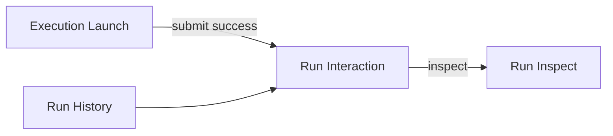
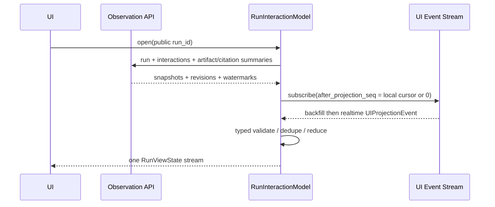

# Frontend Interaction Design

> 架构集：GROVE v1.0
> 上位文档：[GROVE Architecture](./00_GROVE_Architecture.md)
> Public contract：[Platform API](./05_Platform_API.md)
> Typed event：[Canonical Execution Contracts](./16_Canonical_Execution_Contracts.md)
> 观测运维：[Observability and Operations](./12_Observability_and_Operations.md)
> 协作交互：[Multi-Agent Orchestration](./17_Multi_Agent_Orchestration.md)
> P0 验收：[P0 Blockers and Acceptance](./90_P0_Blockers_and_Acceptance.md)

## 1. 定位与所有权

本专题唯一负责：

- 页面信息架构和 MVP 范围。
- Run 信息流、pending interaction 和诊断信息的展示层级。
- 前端 presentation state、typed reducer、SSE 重连和 command UX。
- 多租户前端隔离、可访问性、安全渲染和前端验收。

它不重新定义：

- Run、Action、Child、Interrupt、Permission 的权威状态。
- Platform API 或 Canonical Contract 字段。
- RuntimeEvent、Interaction Projection 或 UIProjectionEvent 的服务端生成协议。
- Skill、Policy、Evaluation 或 Durable Action 的业务规则。

前端只有 presentation state，不拥有第二份 Agent Run state machine：

```text
权威事实/命令                     前端职责
────────────────────────────────  ─────────────────────────────
Agent Run / Checkpoint            展示 AgentRunView
InterruptRef                      展示并提交 typed user response
Action approval                   展示并提交 approval decision
InteractionItem                   展示 pending/resolved 状态
UIProjectionEvent                 幂等归并为 Run 信息流
RuntimeEvent / Trace              只在诊断视图展示
```

## 2. 设计原则

1. **任务叙事优先**：主界面展示“用户要做什么、系统正在做什么、还需要什么、
   最终得到什么”，不倾倒 RuntimeEvent 日志。
2. **阻塞交互优先**：用户输入、permission request、business approval 集中在
   pending interaction 区，不埋在历史消息中。
3. **权威确认优先**：前端提交 command 后只显示 submitting；收到权威
   projection 前不得乐观标记 resolved、approved 或 terminal。
4. **渐进披露**：消息与业务结果默认可见；拓扑、checkpoint、trace、retry
   和 raw event 放入可展开诊断区。
5. **typed event only**：业务 view 只消费 closed-union
   `UIProjectionEvent`，不消费自由 `name + dict` event。
6. **一条 Parent 主线**：Child 只展示状态摘要和待办；Child 详情按 Child
   public `run_id` 单独授权打开，不复制进 Parent timeline。
7. **故障可见**：reconnecting、partial、stale、unknown schema 必须明确展示，
   不能把缺失数据解释成“已完成”或“不存在”。

## 3. 页面信息架构

MVP 只实现三个页面：

| 页面 | 目标 | 主要数据 | 主要命令 |
|---|---|---|---|
| Execution Launch | 选择并预览一次执行 | discover、validate、preview、estimate | submit |
| Run Interaction | 完成当前任务与 HITL | run、interactions、ui events、artifact summary | resume、cancel |
| Run History / Inspect | 找到、复盘和诊断历史执行 | run list、checkpoints、events、trace、artifact | inspect 只读 |

导航关系：



以下页面不进入 MVP：

- 可视化 Graph 编辑器。
- 通用 Agent mailbox。
- Skill Studio、Evaluation 管理和 Publication 控制台。
- 多 Run 实时作战大屏。
- 任意 Prompt、Policy 或 Permission 规则编辑器。

它们只有出现独立用户、权限和验收需求后才增加。

## 4. Execution Launch

页面按稳定顺序呈现：

```text
选择可见 Agent/Skill
  → 根据 published input schema 生成 typed form
  → 选择可见 Permission Preset
  → validate
  → preview + estimate
  → 用户确认
  → submit(expected_skill_spec_hash)
```

必须展示：

- Skill/Agent 名称、精确版本或 release snapshot。
- typed input validation error。
- Permission Preset：`interactive/workspace_edit/read_only/unattended` 中当前
  actor 可见的子集。
- effective permission 摘要、可能的 Action 类别和 required approval。
- Knowledge/Memory/Workspace 使用说明。
- token/cost/latency 范围、预算 hard limit 和 estimate confidence。
- `skill_spec_hash` preview 的短标识和 snapshot 时间。

不能展示或允许编辑：

- credential、内部 Tool 名称、Prompt 正文和无权 Skill。
- tenant ID、scope 正文、Policy rule 或任意 Spec JSON。
- `bypass` preset。
- `replay/fork_*` run mode；这些只能从历史 checkpoint 发起。

`PlanChanged` 时保留用户输入，但旧确认失效；页面必须重新 preview，并明确
标出版本、权限、预算或策略摘要的变化，不能静默提交新计划。

## 5. Run Interaction 页面

桌面布局：

```text
┌──────────────────────────────────────────────────────────────┐
│ Run 标题  public status  Skill Version  Preset  usage/预算   │
├────────────────────────────────────────┬─────────────────────┤
│ 主任务信息流                            │ 运行侧栏             │
│                                        │                     │
│ 用户消息                                │ 当前阶段             │
│ Assistant 流式消息                      │ Parent/Child 摘要     │
│ 关键运行里程碑                          │ Artifact / Citation  │
│ Action/结果摘要                         │ 预算与耗用            │
│                                        │                     │
├────────────────────────────────────────┴─────────────────────┤
│ Pending interactions：输入 / 权限确认 / 业务审批             │
├──────────────────────────────────────────────────────────────┤
│ Composer / Submit / Cancel                                  │
└──────────────────────────────────────────────────────────────┘
```

移动端：

- 运行侧栏收进 Drawer。
- pending interaction 固定在 composer 上方，不能被长 timeline 推离屏幕。
- 同一时间只展开一个高风险 approval；关闭 Drawer 后焦点返回触发控件。

### 5.1 主任务信息流

默认展示：

- 用户消息。
- Assistant message start/delta/completed 合并后的单个消息卡。
- “等待输入”“等待业务审批”“等待 Child”等关键里程碑。
- “领域数据视图已固定”里程碑：只显示授权后的 `observed_at`、记录数、完整性与
  safe provenance，不显示 adapter 实现或原始 Tool payload。业务 Profile 可以按
  `view_schema_ref` 提供领域文案与 renderer。
- 最终业务结果、Citation 和 Artifact。
- succeeded/failed/cancelled terminal 摘要。

默认不展示：

- provider attempt、schema retry、checkpoint ID、lease/fence。
- Tool 原始 request/response。
- Prompt、chain-of-thought、credential、内部 thread/action execution ID。
- 高频 branch/node event。

诊断信息不得伪装成聊天消息。`ContinuationSummary` 正文不进入 timeline；
需要时只显示“上下文已压缩”的脱敏里程碑和 source/hash 摘要。

### 5.2 Pending interaction 区

排序使用稳定规则：

```text
blocking current run first
→ expires_at ascending
→ created_at ascending
→ interaction_id stable tie-breaker
```

三类卡片：

| kind | 展示内容 | 响应路径 |
|---|---|---|
| `user_input` | 问题、typed form、expiry、来源 Run | `ExecutionAPI.resume` |
| `permission_request` | operation、resource 摘要、effect、风险和有效期 | exact `InterruptRef` resume |
| `business_approval` | 业务对象、request digest 摘要、风险、批准/拒绝 | Durable Action approval command |

规则：

1. item 必须显示 `owner_run_id` 对应的安全名称；Child item 带 Child badge。
2. 前端提交 exact source ref、item/run expected revision 和稳定 command ID。
3. 单击后按钮进入 submitting 并防止二次触发；网络重试复用同一 command ID。
4. command receipt 不等于 interaction resolved；收到
   `interaction_resolved` 后才移出 pending 区。
5. stale、expired、cancelled 或 source mismatch 时禁用表单并刷新 snapshot。
6. business approval 不能通过 public resume，permission/user input 不能通过
   approval endpoint。

### 5.3 运行侧栏

运行侧栏只展示有界摘要：

- 当前 public status 和最近一次稳定阶段。
- Skill/Graph/Runtime Build 的短版本标识。
- token/cost/time budget 的 used/reserved/remaining。
- Parent/Child topology：状态、目标 Skill、usage、failure 摘要。
- Artifact/Citation 安全名称、类型、大小和授权读取入口。
- 选择 Asset Risk Reference Profile 时，显示 Asset State View 的 `observed_at`、
  安全 source 名称、记录数和短 result hash；不把它误标为 Knowledge Citation。
  在该 Profile 中出现 View 即表示没有预算截断；其他 Profile 使用自己的 typed
  renderer，不显示空的资产占位区。
- projection `as_of`、completeness 和 reconnect 状态。

首个 MVP 不请求或展示 Parent/Child topology。启用 Multi-Agent Profile 后，
仍不得为每个 Child 建立隐藏 SSE；Parent 页面消费已投影的
`child_status_changed`；只有用户打开 Child 页面后，才按 Child `run_id`
独立授权和订阅。

### 5.4 状态展示

前端标签只解释权威 public status，不另建 lifecycle：

| 权威状态/投影 | 用户标签 | 主界面行为 |
|---|---|---|
| `accepted` | 已提交/排队中 | 允许取消，不显示“执行中”假进度 |
| `running` | 执行中 | 展示最近稳定阶段，不伪造百分比 |
| `waiting_user_input` | 等待你的输入 | 提升对应 interaction card |
| `waiting_action_result` | 等待外部操作 | 展示 Action 摘要；不可用 composer 伪造完成 |
| Action projection waiting approval | 等待业务审批 | display-only `waiting_business_approval`，Run 权威状态仍不改名 |
| `waiting_child_result` | 等待子任务 | 展示相关 Child 摘要，不复制 Child timeline |
| `cancel_requested` | 正在停止后续工作 | 明示已发生 Action 可能无法撤回 |
| `succeeded` | 已完成 | 固定结果、Artifact 与 Citation |
| `failed` | 失败 | safe failure、重新提交入口，不暴露 stack |
| `cancelled` | 已取消 | 不再显示 composer；保留已发生事实 |

running 阶段没有可验证进度分母时只展示阶段和 elapsed time，不显示虚假的
0～100%。

页面刷新只刷新 Run/projection，不重新读取业务数据库。MVP 不显示“刷新本 Run
数据”按钮；terminal 或 failed 页面可以提供“基于当前数据重新运行”，但该操作
必须回到 Execution Launch 并提交新 Run，不能调用 resume 或复用旧 View。

## 6. 前端信息流 Module

前端使用一个深 `RunInteractionModel` module，把 snapshot 组合、SSE、typed
reducer、去重、gap recovery、command pending 和 projection health 隐藏在小
interface 后。页面 view 不得各自创建 SSE 或实现 reducer。

```typescript
type RunUserIntent =
  | RespondToInterrupt
  | DecideActionApproval
  | CancelRun
  | ForkRun;

interface RunInteractionModel {
  getSnapshot(): RunViewState;
  subscribe(listener: () => void): () => void;
  dispatch(intent: RunUserIntent): Promise<RunIntentDispatchResult>;
  close(): void;
}
```

`RunIntentDispatchResult` 只归一化 transport 的 accepted/rejected/conflict 和
safe error code；`accepted` 不表示 interaction、Action 或 Run 已完成。

`RunViewState` 是 presentation model，只包含：

```text
run summary
ordered message views
ordered pending/resolved interaction views
child summaries
artifact/citation summaries
projection health + cursors
local command submission states
```

它不包含 LangGraph State、authorization object、credential、Prompt 或 raw
provider response。

module 依赖从构造入口注入：

- `ExecutionClient`。
- `ObservationClient`。
- `ActionApprovalClient`。
- clock、redaction-safe telemetry。

production 使用 HTTP/SSE adapter；contract/reducer tests 使用 deterministic
in-memory adapter。这是前端测试 seam，不要求把每个页面拆成独立网络层。

## 7. Bootstrap、SSE 与 typed reducer

首次进入 Run 页面：



MVP 首次加载允许从 `projection_seq=0` 按有界 batch 回放 UI event history；
每批应用后释放 transport buffer，不能把全部历史一次性载入内存。它与
Interaction snapshot 按 source revision 去重。只有真实数据证明启动时间或事件
保留成本超预算后，才增加由同一 projector 生成的 compact presentation
snapshot；它仍是 read model，不是新权威状态。

### 7.1 Projection sequence

```text
event.projection_seq <= cursor
  → duplicate，忽略

event.projection_seq == cursor + 1
  → 校验 schema/source，应用并推进 cursor

event.projection_seq > cursor + 1
  → 标记 reconnecting，暂停后续应用，按缺口查询补齐
```

缺口补齐前可以展示最后一个完整 view，但必须显示 reconnecting；不得把缺口后的
event 越序应用。未知 discriminator/schema 进入客户端安全 telemetry，并把相关
view 标记 `partial`；不能用通用 JSON renderer 猜测。

### 7.2 Event → View 映射

| event kind | reducer 行为 | UI 行为 |
|---|---|---|
| `message_started` | 按 `message_id` 创建 placeholder | 一个流式消息卡 |
| `message_delta` | 按 `message_id + delta_seq` 去重排序 | 批量追加安全 delta |
| `message_completed` | 校验 `last_delta_seq/content_hash` | 结束 streaming |
| `interaction_upserted` | 仅接受更高 item/source revision | 新增或更新 pending card |
| `interaction_resolved` | 校验 source 和 revision 后转 terminal | 移出 pending，保留摘要 |
| `run_status_changed` | 仅按权威 run revision 更新 | header + 关键里程碑 |
| `domain_view_accepted` | 按 `tool_request_id + result_hash` 去重，只接受权威 source revision | 领域数据视图里程碑与侧栏 provenance；按 `view_schema_ref` 选择 Profile renderer |
| `child_status_changed` | Multi-Agent Profile 启用后按 Child/delegation revision 更新 | 侧栏；关键状态进入主流 |

消息不能按到达时间重排；Child 不能按完成顺序改变稳定拓扑；terminal 状态不能
由 loading spinner、HTTP 200 或本地 timeout 推断。

### 7.3 Projection health

| 状态 | 展示 | 可执行操作 |
|---|---|---|
| `loading` | skeleton，不显示伪空态 | 无 |
| `live` | 正常信息流 | 按当前 item 权限 |
| `reconnecting` | 非阻塞连接提示，保留完整旧 view | 暂停依赖新 revision 的提交 |
| `partial` | 标明缺失类别和 `as_of` | 仅允许与缺失 source 无关的安全操作 |
| `stale` | 强提示刷新 | 禁止旧 revision 提交；cancel 先做一次当前 Run snapshot refresh |
| `terminal` | 固定最终状态和结果摘要 | inspect，不能继续输入 |
| `unavailable` | 明确无权、未启用或投影不可用 | 不伪装为空结果 |

此处 `partial` 只表示前端 projection source 尚未收敛，不表示 ToolResult 或 Run
Data View 不完整。业务结果的 partial/completeness 语义只能由 versioned Tool
contract 定义；前端 projection health 不得推导或覆盖它。Asset Risk Reference
Profile 的完整成功语义见
[Asset Risk Reference Business Profile](./31_Asset_Risk_Reference_Profile.md)。

## 8. Command UX 与错误映射

每次用户动作生成一次稳定 command ID；按钮重试复用该 ID。前端本地 command
状态只有：

```text
idle → submitting → accepted_waiting_projection → confirmed
                  └→ rejected/conflict
```

本地状态不改变服务端业务状态。页面错误映射：

| error | 用户行为 |
|---|---|
| `InputContractInvalid` | 保留草稿并显示安全 field violations；不得自动删项、截断或改写输入后重试 |
| `PlanChanged` | 回到 preview，展示差异并重新确认 |
| `RunStateConflict` | 刷新 Run/Interaction snapshot；保留未提交草稿 |
| `CheckpointUnavailable` | 标记 interaction stale，不自动换 ref 重试 |
| `PermissionDenied` | 停止请求并显示无权；不泄露目标是否存在 |
| `ProjectionNotReady` | 显示 partial/retry-after，不显示伪终态 |
| `CapabilityUnavailable` | 显示该功能未启用，不退化到其他执行路径 |
| `ToolQueryTooBroad` | 不展示 contract 禁止的 partial result；显示安全 `limit_kind` 和 Profile 提供的收窄/新建 Run 操作 |
| `ResourceSelectionUnavailable` | 统一显示“所选资源不可用或无权访问”；不标记具体项、不显示 omitted count，按 Profile 规则重新选择 |
| network timeout | 使用同一 command ID 查询/重试，不能生成第二个语义动作 |

Cancel 只显示“请求停止未来工作”，不能宣称撤销已经发生的 Action。

## 9. Multi-Agent 信息流

Parent 页面遵循：

```text
Parent 主 timeline
  ├─ Child accepted / waiting / terminal 摘要
  ├─ attached Child 的 pending interaction 提升到统一待办区
  └─ Child 详情链接
```

- Child 消息、trace、checkpoint 不复制到 Parent timeline。
- 同一 Child interaction 在待办区只出现一次；presentation run 是 Parent，
  owner run 仍是 Child。
- Parent terminal 后迟到 Child completion 只更新审计/侧栏，不重开 composer。
- `all/any_success/quorum/collect/detached` 只显示 Policy 结果；前端不自行计算
  Join 是否满足。
- topology 为 `partial/stale` 时不得显示“无 Child”或“全部完成”。

## 10. 多租户与安全

1. 所有 query/cache/store key 至少包含认证 session scope、tenant context 和
   public run/ref；不能只用 `run_id`。
2. tenant 或 actor context 切换时，先关闭 SSE，再清空 query cache、
   RunInteractionModel、pending command 和 artifact URL。
3. 客户端 role gate 只用于 UX；服务端每个 Plan/Observation/Command 仍独立
   授权。
4. 不在 URL、analytics、错误消息或 DOM attribute 中保存 tenant、internal
   thread/checkpoint/action execution ID。
5. 不把消息、Interaction payload、Artifact signed URL 或 input draft 长期写入
   `localStorage`；需要恢复草稿时使用 tenant-scoped、过期和加密策略。
6. Markdown 使用 allowlist renderer；禁任意 HTML、script、event handler、
   unsafe URL scheme 和未经确认的外链。
7. Artifact/Citation 点击时重新授权；过期 signed URL 不在客户端续签猜测。
8. 不渲染 Prompt、chain-of-thought、credential、provider raw response 或未脱敏
   trace attribute。

## 11. 可访问性与响应式

- 状态不能只靠颜色；同时提供文本和图标语义。
- pending interaction 到达时更新页面标题/计数，但不强制抢焦点。
- 用户主动打开 interaction 后，焦点进入首个有效字段；提交/关闭后返回来源。
- streaming delta 不逐 token 写入 `aria-live`；按有界批次更新，完成后播报一次。
- approval 的批准与拒绝不能仅靠位置/颜色区分，高风险操作需要清晰对象和结果。
- 键盘可完成导航、表单、展开详情和提交；Drawer/Dialog 正确管理 focus trap。
- timeline 虚拟化不能破坏键盘顺序、锚点、复制和屏幕阅读器语义。

## 12. 性能与资源边界

- 一个打开的 Run 页面只维护一个 UI projection stream。
- 不为折叠 Child、Artifact 或诊断 panel 预建 SSE。
- message delta 在保持 `delta_seq` 的前提下做有界批量渲染，避免每 token
  触发全树更新。
- Store 使用 normalized map；timeline 只保存有序 ID，不复制 payload。
- 长 timeline 使用可访问的 windowing，并保留当前 interaction 和滚动锚点。
- reconnect 使用有界 exponential backoff + jitter；收到 server retry hint 时
  遵循更严格值。
- 浏览器后台时可以降低非阻塞动画/诊断刷新，但不能丢 projection cursor 或
  自动关闭 pending command reconciliation。
- slow client、event burst 和多标签页必须满足
  [P0 SSE/Projection 预算](./90_P0_Blockers_and_Acceptance.md)。

## 13. MVP 与后续阶段

### MVP

- Execution Launch typed form、preview、estimate、四种 approved preset。
- Run header、message stream、pending interaction、composer、cancel。
- Artifact/Citation 与 Asset State View provenance 摘要。
- Run History 和基础只读 Inspect。
- typed reducer、cursor backfill、reconnect、partial/stale。
- 多租户 cache reset、安全 Markdown 和基础 accessibility。

### 真实需求出现后

- compact Run presentation snapshot。
- replay、fork dry-run、fork commit 和 time-travel UI。
- Parent/Child 状态摘要、Child interaction routing 和 topology projection。
- 高级 topology graph 和 trace waterfall。
- Skill/Evaluation/Publication 管理页面。
- tenant policy、quota、deployment profile 管理。
- 多 Run 运营视图和通知中心。

这些扩展复用 `RunInteractionModel` 和 Observation contracts；不得再建立第二套
event bus、message state 或 permission engine。

## 14. 验收

### Reducer contract

1. 对每种 UIProjectionPayload 使用 versioned golden fixture。
2. duplicate、乱序、gap、unknown schema、迟到 resolved 不产生重复消息或
   interaction。
3. message delta 的 canonical final hash 与服务端一致。
4. Multi-Agent Profile 启用后，Child 状态乱序不改变稳定 topology；同 revision
   不同 hash 明确冲突。
5. 前端 reducer 对同一 golden event stream 重放两次，得到相同
   `RunViewState` canonical snapshot；这不是产品级 Agent Run replay。

### Command

1. 双击、刷新和网络 timeout 复用同一 command ID，服务端语义应用一次。
2. stale/expired/cross-run interaction 的真实 reducer/Action decision 数为 0。
3. business approval 与 public resume 不能互换。
4. command accepted 但 UI delta 延迟时保持 waiting projection，不乐观完成。

### E2E

1. Launch → preview → submit → stream → terminal 完整路径。
2. PlanChanged 后必须重新确认。
3. user input、permission request、business approval 各自成功、拒绝、过期、
   并发冲突路径。
4. Child HITL 在 Parent 待办区响应 exact Child ref；无权 Child detail 不可见。
5. SSE 断开、cursor gap、projector partial/stale 后最终收敛且无重复展示。
6. tenant/actor 切换后旧消息、interaction、artifact URL 和 SSE 均不可访问。
7. 键盘、屏幕阅读器、移动端和长 timeline 达到产品 accessibility/performance
   预算。

## 15. 被否决的方案

- 页面 view 直接订阅 SSE 并各自解释 event。
- 把 RuntimeEvent 日志作为主聊天信息流。
- 使用通用 `any`/JSON renderer 兼容未知 UI event。
- command HTTP 200 后乐观标记 approval/resume/terminal 成功。
- 在 Parent 页面复制所有 Child message/event。
- 前端自行计算 permission、Join、terminal 或 Action 状态。
- 以 `localStorage` 作为敏感 Run/Interaction 的持久化来源。
- 为 MVP 预建 Graph Studio、通用 inbox、通知中心或运营大屏。
