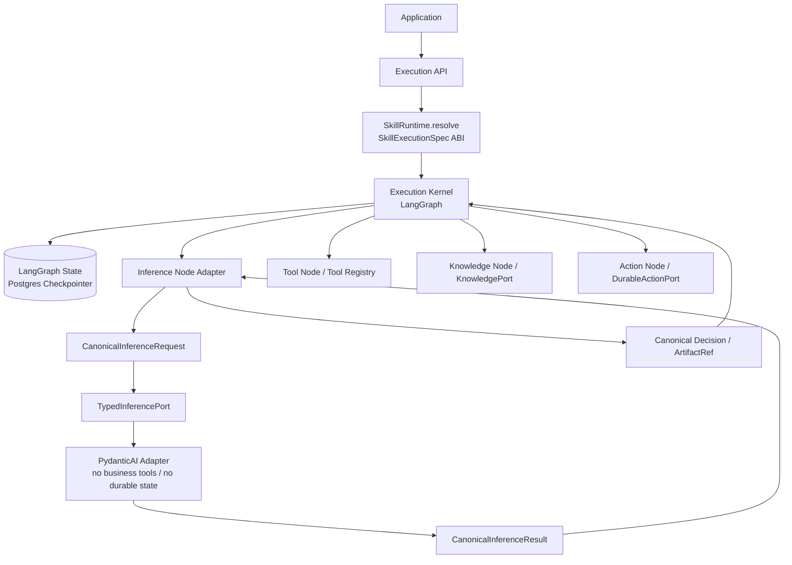

# LangGraph + PydanticAI Integration

> 架构集：GROVE v1.0
> 上位文档：[Execution Core](./10_Execution_Core.md)
> Contract 规范：[Canonical Execution Contracts](./16_Canonical_Execution_Contracts.md)
> 决策：[ADR-0001](./adr/0001-langgraph-execution-kernel.md)

## 1. 决策

LangGraph 与 PydanticAI 不作为两个 Agent Runtime 叠加：

```text
LangGraph
  = GROVE Execution Kernel

PydanticAI
  = TypedInferencePort production adapter

Canonical Execution Contracts
  = module 之间的稳定 typed messages
```

Canonical Contracts 不是第四份 Runtime State、统一 mutable context 或通用
Graph IR。LangGraph State 仍是 Agent Run 执行状态的唯一持久化来源。

## 2. 正确架构



不采用：

```text
Canonical Model
  ├─ LangGraph Adapter
  └─ PydanticAI Adapter
```

该结构会错误地把 LangGraph 降为普通 adapter，并重新暗示两个可互换、
平级的 runtime。当前只有 PydanticAI 位于可替换 inference seam；
LangGraph 是明确选定的 Kernel。

## 3. 状态所有权

| 数据 | 所有者 | 允许持久化 |
|---|---|---|
| 当前 node、next route、loop、parallel task | LangGraph State | Checkpointer |
| interrupt、resume、checkpoint、time travel | LangGraph | Checkpointer |
| Skill/Graph/contract/policy version | `SkillExecutionSpec` + `agent_run` | Runtime projection + checkpoint metadata |
| 一次 inference request/result | LangGraph inference node | Canonical result、usage、attempt references |
| PydanticAI `RunContext`/messages/provider object | PydanticAI adapter | 仅调用期间；不得进入权威 State |
| business Tool/Action result | 对应 LangGraph node / runtime owner | canonical result/reference |

禁止同时维护：

```text
LangGraph State
+ duplicate Platform ExecutionContext
+ PydanticAI Context
```

GROVE 不再定义 mutable `ExecutionContext`。跨 module 只传 immutable request、
result、command 和 reference。

## 4. Canonical Execution Contracts

Canonical Model 应实现为一组小型、可版本化 Pydantic contracts，而不是
一个包含全部运行信息的大对象。

核心 contracts：

```text
SkillExecutionSpec
CanonicalInferenceRequest
CanonicalInferenceResult
InferenceDecisionPayload
CanonicalDecision
KnowledgeRequest / KnowledgeResult
ToolCommand / ToolResult
ActionCommand / ActionHandle
ArtifactRef
RuntimeEvent
```

它们遵循：

1. `extra="forbid"`。
2. 明确 `contract_version`。
3. 只携带调用所需最小数据。
4. 大内容使用 `ArtifactRef`，不复制进多个对象。
5. 不包含 LangGraph/PydanticAI/DBOS 内部 class。
6. input 与 result contract 可独立演进，但必须有兼容策略。

本文件只规定 LangGraph/PydanticAI 集成所需子集。Knowledge、Memory、
Tool、Action、Artifact、Failure 和 Event 的规范定义见
[Canonical Execution Contracts](./16_Canonical_Execution_Contracts.md)。

## 5. Inference Contracts

本专题不复制 class schema。`CanonicalInferenceRequest`、
`CanonicalInferenceResult`、`InferenceDecisionPayload` 和
`CanonicalDecision` 的唯一规范定义位于
[Canonical Execution Contracts](./16_Canonical_Execution_Contracts.md)。

集成只依赖以下不变量：

1. request/result 使用 `ContractMeta`、frozen model 和 `extra="forbid"`。
2. `input/result` 对应已发布 typed schema，不能退化为
   `dict[str, Any]`。
3. `context/instructions` 是 Node Adapter 已裁剪和脱敏的有界内容。
4. PydanticAI 的 result type 是不含 tenant/run/authorization 的
   `InferenceDecisionPayload`。
5. Node Adapter 是 Canonical Decision 的唯一创建者。

## 6. Node Adapter

Node Adapter 属于 LangGraph Kernel implementation：

```text
LangGraph State
  → select minimum state projection
  → CanonicalInferenceRequest
  → PydanticAI input/output model
  → CanonicalInferenceResult
  → validate InferenceDecisionPayload
  → CanonicalDecision / ArtifactRef
  → LangGraph State update / Command
```

所有转换单向执行，不做“把完整 PydanticAI Context 映射回 State”：

1. 从 State 读取当前 node 所需字段。
2. 通过显式 Knowledge/Memory/Artifact node 解析上下文，并按预算裁剪。
3. 解析 Prompt/Model/Retry policy，构造自包含 canonical request。
4. adapter 将 canonical request 转为 PydanticAI input。
5. PydanticAI 执行一次逻辑 inference。
6. adapter 丢弃 provider/PydanticAI 内部对象，只返回 canonical result。
7. Node Adapter 验证 request ID 和 contract version。
8. 将 Decision/Artifact 写回 State；LangGraph 决定下一条 edge。

Node Adapter 不执行业务 Tool、不持有 credential、不决定 run route。
PydanticAI adapter 除 model provider 和 telemetry exporter 外，不访问
Knowledge、Memory、Artifact、Registry 或业务数据库。

## 7. TypedInferencePort

```python
class TypedInferencePort(Protocol):
    async def infer(
        self,
        request: CanonicalInferenceRequest[InputT],
        *,
        result_type: type[ResultT],
    ) -> CanonicalInferenceResult[ResultT]: ...
```

adapter：

- PydanticAI production adapter。
- deterministic fake。
- recorded-result adapter，用于 replay/evaluation。

三种真实 adapter 使该 seam 有实际价值。替换模型 SDK 或 PydanticAI 时，
调用者与 Graph State 不变。
recorded-result adapter 只能通过 Canonical `ReplayRecordingRef` 的 source
node/seam/ordinal key 定位，并校验 request/result hash；不能按新 run 的
request ID 查 cache，也不能在 miss 时退回 PydanticAI。

### 7.1 受限 Adapter Interceptor SPI

借鉴 AgentScope middleware 的易组合 hook，但 GROVE 只在已存在的 adapter/
projector seam 提供一个窄接口；Graph caller 只认识 chain，不认识各插件：

```python
class AdapterInterceptorChain(Protocol, Generic[RequestT, ResultT]):
    async def invoke(
        self,
        request: RequestT,
        terminal: Callable[[RequestT], Awaitable[ResultT]],
    ) -> ResultT: ...
```

chain 内部只接受三类 versioned interceptor：

| 类型 | 能力 | 禁止 |
|---|---|---|
| `Observer` | 读取脱敏 before/after/failure view | 修改、短路或反压在线执行 |
| `Transformer` | 按 seam allowlist 返回新的 typed request/result | 修改身份、权限、effect、schema、ID 或动态增加 Tool |
| `Guard` | 返回额外 narrowing 或 `DENY` | 返回 `ALLOW`、替代 Kernel authorization 或跳过 reauth |

调用顺序由 `RuntimeBuildManifest` 固定为 `observers.before → guards →
transformers → terminal → observers.after/failure`；同类内部顺序、版本、hash
和 failure policy 也固定。插件不接收
mutable Agent、LangGraph State、任意 `dict` 或可选择不调用的 `next_handler`。
chain 在 terminal 前后重新执行 canonical schema、size limit 和
semantic-subset 校验；transform 后的 request 必须仍是已授权原 request 的子集。

允许的 seam 初始仅为 inference、Knowledge、Memory、Tool adapter 和
Observation projector。禁止拦截 Graph route/reducer、checkpoint、interrupt、
Run Signal、permission resolver 或 Durable Action acceptance。context
compression、memory recall/write、delegation 和 HITL 都保持显式 Graph node/
command，不能藏入 hook。

security/redaction、Guard、Transformer 失败时 fail closed；纯 metrics/tracing
Observer 可以按有界 policy 降级，但必须产生脱敏 health/audit signal，且不能
阻塞或无界排队。interceptor 的 start/close 由 worker lifecycle 统一管理，
后台任务不得越过 run/worker shutdown。chain/order/failure policy 的 hash
进入 Runtime Build 与 Evaluation Subject；活动 run 不接受动态注册。

## 8. PydanticAI 使用约束

允许：

- typed input/dependencies。
- structured output schema。
- output validation。
- bounded output/schema retry。
- model/provider interaction。
- usage、messages 和 provider response 的标准化观测。

禁止：

- executable function tools、toolsets、MCP tools 或 capability bundles。
- Tool/Knowledge/Memory/Action 调用。
- multi-agent delegation 或 nested agent loop。
- cross-invocation message state。
- PydanticAI durable execution integration。
- output function 中的业务副作用。

允许的 PydanticAI dependency 仅限 model client、resolved settings、
trace context 和纯计算 validator；不得注入 repository、KnowledgePort、
MemoryPort、ToolRuntime 或 DurableActionPort。

对话历史由 LangGraph State 选择并转换成 canonical messages 随 request
传入；PydanticAI 不维护自己的跨调用 message history。

production code 只能通过 `PydanticAIAdapterFactory` 创建内部 Agent/Model
调用对象。factory interface 只接受 model client、resolved model settings、
result schema、retry budget 和 telemetry；不接受 `tools`、`toolsets`、MCP、
capabilities、history store 或 arbitrary dependencies。

启动时 factory 必须：

1. 验证 adapter build 与受支持 PydanticAI version matrix。
2. 断言 combined executable toolset、MCP server 和 durable capability 为空。
3. 断言 dependency type 只包含 allowlist 中的纯 inference dependency。
4. 区分 provider structured-output definition 与 executable function tool。
5. 任一违规在首个 model request 前 fail fast 并形成配置审计事件。

内部 PydanticAI `Agent` 不从 adapter module 导出，业务代码不能在运行时追加
decorator tool。contract test 必须覆盖恶意 tool/toolset/MCP/durable/history
配置，真实 provider request 数为 0。

### Structured-output tool 不是 business Tool

PydanticAI 的 structured output 可能使用 provider tool-calling 编码
output schema。这类 output tool：

- 只传输最终结构化结果。
- 不访问企业数据或外部系统。
- 不进入 Tool Registry。
- 不产生业务 side effect。
- result 生成后结束当前逻辑 inference。

它与 `ToolProposal/ToolCommand` 指向的 business Tool 完全不同。启动检查应禁止
function tools/toolsets/MCP/durable capability，而不是错误地禁止 provider
structured-output transport。

## 9. Decision 与 Tool 边界

```python
CanonicalDecision = (
    FinalAnswer
    | KnowledgeProposal
    | ToolProposal
    | ActionProposal
    | DelegateProposal
)
```

PydanticAI 只生成无可信 metadata 的 Payload：

```text
PydanticAI output
  → InferenceDecisionPayload
  → Node Adapter validates and enriches
  → CanonicalDecision
  → LangGraph policy node
      ├─ authorize
      ├─ reject
      ├─ ToolCommand → Tool node
      ├─ KnowledgeRequest → Knowledge node
      ├─ ActionCommand → Action node
      └─ DelegateProposal
           → DelegationCommand(mode=subgraph) → subgraph
           └─ DelegationCommand(mode=child_run)
                → optional Run Delegation Coordinator
```

Tool Registry 统一管理 schema、version、effect、permission、timeout、
replay 和 audit。不存在第二套 PydanticAI Tool Registry。
execution mode、delegation ID、Child Run、Join 和 budget 都由 LangGraph
policy node 决定；PydanticAI 不运行 nested Agent/Swarm/GoalLoop。

PydanticAI 只看到当前 SkillExecutionSpec closure 内精确 Tool ref 与 input schema，
并以 `extra="forbid"` 校验 payload；它看不到 Tenant/Principal、可信 scope/budget、
adapter client 或实现对象。数据库型 adapter 的 SQL、schema/table/column selector
和连接信息始终是 adapter 私有实现，不能借 Tool 注册暴露给模型。首个具体 binding
见 [Asset Risk Reference Business Profile](./31_Asset_Risk_Reference_Profile.md)。

## 10. Retry 与错误所有权

同一种 failure 只能有一个 retry owner：

| Failure | Retry owner | 约束 |
|---|---|---|
| output/schema validation | PydanticAI adapter | 同一 logical inference 内有界修复；记录 `schema_retries` |
| provider HTTP/rate-limit/transient error | PydanticAI/provider adapter | 使用 versioned policy；记录每次 provider attempt |
| adapter 在 model request 前失败 | LangGraph node policy | 可以安全 retry |
| provider retry budget exhausted | LangGraph error route | 不再自动重复同一 retry policy；选择 fail/HITL/new inference |
| node code、state reducer、routing failure | LangGraph | checkpoint resume |
| business side effect/external workflow | Durable Action Runtime | 端到端 idempotency + receipt |

“一次 Node 调用对应一次推理”指一次 logical inference，内部可能因 schema
或 provider policy 产生多个 HTTP attempt。

必须有总预算：

```text
provider_attempts ≤ provider_retry_budget
schema_retries ≤ schema_retry_budget
logical_inferences_per_node ≤ graph_policy_budget
total_model_requests_per_run ≤ run_budget
```

LangGraph 不应在 PydanticAI 已耗尽 provider/schema retry 后，再用默认 node
retry 盲目重复同一 logical inference。显式重新推理必须生成新的
`inference_request_id` 并留下原因。

无法保证模型请求 exactly-once：provider 成功但响应丢失时可能重复计费或
得到不同结果。系统保证的是 bounded、observable 和 checkpoint 后可重放，
不宣称 exactly-once inference。

## 11. Version

独立管理：

| Version | 绑定内容 |
|---|---|
| `canonical_contract_version` | Canonical request/result/decision schema |
| `graph_version` | nodes、edges、Node Adapter code、State schema mapping |
| `graph_state_schema_version` | checkpoint State fields/reducers |
| `prompt_policy_version` | Prompt artifact 和 instruction policy |
| `model_policy_version` | provider/model/settings/fallback |
| `inference_retry_policy_version` | provider/schema retry budgets |
| `typed_inference_adapter_version` | PydanticAI adapter implementation |
| `runtime_build_hash` | platform/framework/adapter dependency 与 worker image 精确构建 |

这些版本通过 Graph/Contract binding、typed policy ref 或
`SkillRuntimeManifest`/`RuntimeBuildManifest` 被 `SkillExecutionSpec` ABI
精确绑定；核心恢复字段进入 `agent_run` 和 checkpoint metadata。缺少历史
contract/adapter/migrator 时 fail fast。

升级规则：

1. Canonical contract 新增 optional/default 字段。
2. 不兼容 contract 使用新 version 和显式 converter。
3. Graph State migration 与 Canonical contract migration 分开。
4. Node Adapter 与 `graph_version` 一起发布。
5. historical replay 默认读取录制的 canonical result。

## 12. 替换范围

Canonical Contracts 保证：

- Application 不依赖 PydanticAI model。
- Memory/Evolution 不依赖 LangGraph/PydanticAI 内部对象。
- PydanticAI 可以经 `TypedInferencePort` 替换。
- Tool/Knowledge/Action adapter 可以独立替换。

它不保证：

- LangGraph 可像普通 adapter 一样透明替换。
- 任意 Graph Runtime 都支持相同 checkpoint/interrupt/time-travel 语义。
- 历史 LangGraph checkpoint 可被其他 runtime 直接读取。

未来若替换 LangGraph，应作为 Execution Kernel migration 项目，显式迁移
State、checkpoint、interrupt 和 graph semantics；当前不预建
`GraphExecutorPort` 或最低公共能力 IR。

## 13. 运行事件

至少记录：

```text
inference_requested
provider_attempted
schema_retry_requested
inference_succeeded
inference_failed
decision_produced
```

event 包含 request ID、contract/policy/adapter versions、attempt counters、
usage、latency 和脱敏 error。不保存 credential 或未治理完整 prompt。

RuntimeEvent/Artifact 再进入 Experience Projection；Memory Curator 与
Evolution Module 不直接消费 PydanticAI message objects。

## 14. 技术依据

- [LangGraph Persistence](https://docs.langchain.com/oss/python/langgraph/persistence)
- [LangGraph Interrupts](https://docs.langchain.com/oss/python/langgraph/interrupts)
- [LangGraph Graph API and Retry Policies](https://docs.langchain.com/oss/python/langgraph/use-graph-api)
- [PydanticAI Agents](https://pydantic.dev/docs/ai/core-concepts/agent/)
- [PydanticAI Structured Output](https://pydantic.dev/docs/ai/core-concepts/output/)
- [PydanticAI Function Tools](https://pydantic.dev/docs/ai/tools-toolsets/tools/)
- [PydanticAI Durable Execution](https://pydantic.dev/docs/ai/capabilities/durable_execution/overview/)
- [AgentScope MiddlewareBase](https://github.com/agentscope-ai/agentscope/blob/9d1026fad17e6a985873c0981bb8d4aeacf98cf9/src/agentscope/middleware/_base.py)
