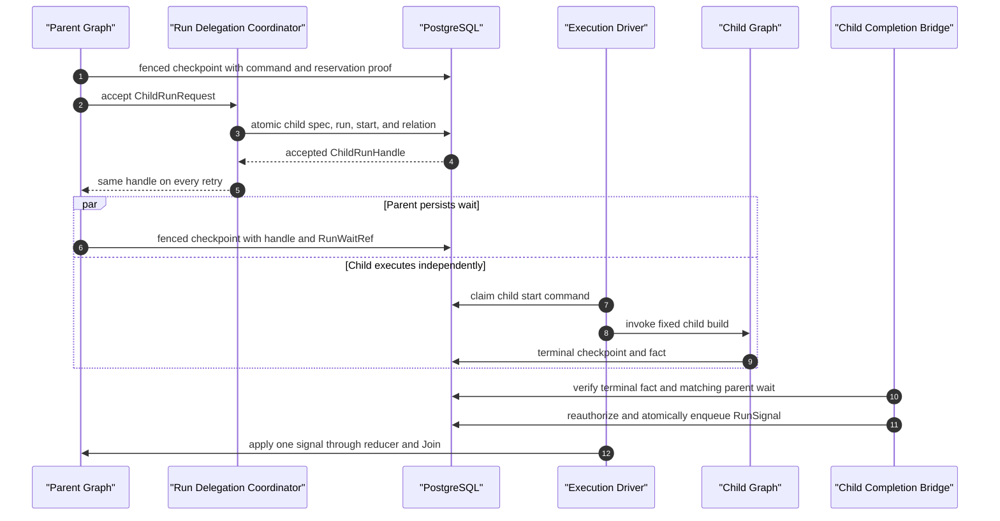

# Multi-Agent Orchestration

> 架构集：GROVE v1.0
> 上位文档：[GROVE Architecture](./00_GROVE_Architecture.md)
> Core 语义：[Execution Core](./10_Execution_Core.md)
> Contract 规范：[Canonical Execution Contracts](./16_Canonical_Execution_Contracts.md)
> 执行 ABI：[SkillExecutionSpec ABI](./21_SkillExecutionSpec_ABI.md)
> P0 验收：[P0 Blockers and Acceptance](./90_P0_Blockers_and_Acceptance.md)

## 1. 定位与权威范围

本文唯一负责：

- Sub-agent、Swarm、GoalLoop 的规范语义和选择规则。
- 同一 Agent Run 内的 subgraph、fan-out/fan-in、loop 约束。
- Parent Run 与独立 Child Run 的可靠委派、完成通知、Join 和取消语义。
- schedule/event trigger 如何进入统一 Execution API。
- Multi-Agent 的事件词表、trace 关联和拓扑投影要求。

本文不重新定义：

- Agent Run lifecycle、checkpoint、Execution Driver 和 RuntimeEvent transport；
  它们属于 `10`。
- Canonical typed message 字段；它们属于 `16`。
- Skill closure、permission、budget 和执行 ABI；它们属于 `20/21`。
- 外部副作用、业务审批和长外部任务；它们属于 `40`。
- blocker 状态和量化门槛；它们属于 `90`。

本专题不属于首个 MVP。MVP 即使使用 LangGraph subgraph 组织代码，也只能视为
单一 Skill 内的 Execution Subgraph；没有 fixed-version child Skill 委派、角色、
协作事件或拓扑投影时，不得称为 Sub-agent。Multi-Agent Release Track 按
same-run bounded fan-out、bounded GoalLoop、独立 Child Run 的顺序启用。

核心约束：

> **Sub-agent、Swarm 和 GoalLoop 是 LangGraph 图拓扑，不是新的 Agent 类型或
> Runtime。只有确实需要独立 lifecycle 的工作才创建 Child Run；Child Run
> 仍由同一 Execution Core 执行。**

PydanticAI 只能生成 `DelegateProposalPayload`。Node Adapter 注入可信
provenance 后形成 `DelegateProposal`，再由 LangGraph policy node 校验并
生成 `DelegationCommand`。模型不能直接启动 subgraph、Child Run 或 fan-out。

## 2. 模式选择

| 需求 | 模式 | 默认实现 | 是否新建 Agent Run |
|---|---|---|---|
| 调用一个边界清晰、执行后返回的子能力 | Sub-agent | per-invocation subgraph | 否 |
| 对有限任务集合并行分析并归并结果 | Swarm | Supervisor + `Send` + keyed reducer | 否 |
| 围绕目标反复执行、评估和继续 | GoalLoop | 显式循环 edge + 终止 policy | 否 |
| 子任务需独立 SLA、扩缩容、取消或长时间等待 | Child Run | Run Delegation | 是 |
| 需要早返回的 `any/quorum`，且剩余成员应独立取消 | Child Run group | 多个 Run Delegation + 父图 Join | 是 |
| 外部写、审批、定时等待或长外部作业 | Durable Action | `DurableActionPort` | 否 |
| 固定时间或受信任事件启动一项新工作 | Execution Trigger | 普通 `ExecutionAPI.submit()` | 是 |

默认规则是 **same-run first**。以下任一事实成立时才使用 Child Run：

1. 子任务需要在父 Run 终止后继续。
2. 子任务需要独立 deadline、budget、资源池、重试或取消。
3. 父图不能合理地跨越其等待时间持有同一个 run lifecycle。
4. 需要 `any/quorum/detached` 等跨独立执行单元的 Join 语义。
5. 合规要求子任务使用独立 principal binding、审计或数据驻留。

“代码看起来像另一个 Agent”不是创建 Child Run 的理由。

## 3. 标识、状态与预算不变量

Multi-Agent 相关标识：

| 标识 | 含义 |
|---|---|
| `orchestration_id` | 一个 live 执行树的稳定分组；Child Run 继承，time-travel 新 run 默认新建 |
| `orchestration_depth` | 当前 Run 距 orchestration root 的 Child Run 边数 |
| `delegation_depth` | 当前逻辑调用栈中 subgraph 与 Child Run 委派边数之和 |
| `node_execution_key` | graph path、node、invocation ordinal 和 branch key 的确定性组合 |
| `delegation_id` | 一次逻辑委派；由 Kernel 确定性派生，模型和客户端不能提供 |
| `logical_delegation_ordinal` | 同一 node execution 内业务上第几次委派 |
| `fanout_branch_id` | 一个 same-run fan-out 分支的稳定 key；不同于 Run Lineage `branch_id` |
| `parent_run_id` | Child Run 的直接 Parent Run；不是 time-travel source run |
| `parent_delegation_id` | 创建 Child Run 的委派 |
| `goal_id` | GoalLoop 中目标实例的稳定 ID |
| `goal_iteration` | 已提交 checkpoint 的目标迭代序号 |

`root_run_id/source_run_id` 只表示 replay/fork 的 Run Lineage；
`orchestration_id/parent_run_id` 表示在线 Parent/Child 协作。两者不能混用。
普通 submit 和 time-travel 新 run 都以自身 `run_id` 初始化新的
`orchestration_id`；只有 Run Delegation 创建的 Child 才继承 Parent
`orchestration_id`。

`orchestration_depth` 用于 Child Run 拓扑、active descendant admission；
`delegation_depth` 才是防止 subgraph/Child 交替递归的统一 hard limit。每次
进入 subgraph 或 Child Run 都加 1，返回父调用栈后恢复；GoalLoop 的顺序迭代
计入 iteration/step budget，不因轮数累加 delegation depth。两者都由 Kernel
计算，模型不能提供。

确定性 delegation ID 只标识逻辑槽位：

```text
tenant_id
parent_run_id
parent node execution key
logical delegation ordinal
```

独立 semantic digest 再覆盖：

```text
target Skill Version
typed input semantic hash
execution mode / schema / delegated permission / budget / deadline
```

同一 key、相同 semantic digest 必须返回原结果；同一 delegation key、
不同 digest 必须 `DelegationConflict`，同一 fan-out key、不同 result hash
必须 `BranchResultConflict`。不能以随机 UUID 或
`ON CONFLICT DO NOTHING` 掩盖输入漂移。

所有确定性 UUID 使用 Canonical Contract 固定的 ID scheme version 和
canonical JSON bytes。v1 先从平台固定 namespace 与内部 tenant ID 派生
`tenant_namespace_uuid`，再使用：

```text
delegation_id =
  uuid5(tenant_namespace_uuid,
        canonical(["delegation-v1", parent_run_id,
                   node_execution_key, logical_ordinal]))

child_submission_id =
  uuid5(tenant_namespace_uuid,
        canonical(["child-submit-v1", delegation_id]))
```

平台 namespace 和 scheme version 是发布制品，不能随进程配置漂移。不同语言/
worker 必须通过相同 golden vectors；禁止把任意 tenant 字符串当成 UUID
namespace，或使用默认对象序列化结果派生 ID。

预算采用父包络内分配：

```text
sum(reserved child/branch budgets) <= parent remaining budget
child effective permission <= parent delegated permission ∩ target Skill permission
child deadline <= parent delegated deadline
```

每次 fan-out/Child Run acceptance 前先原子预留 concurrency、token、cost 和
descendant-run quota；终态后按实际 usage 结算。不能把父 Run 的完整预算复制
给每个分支。

same-run reservation、remaining budget 和结算属于父 LangGraph State，并随
checkpoint 提交。Child Run reservation 必须已存在于 prepared delegation
checkpoint；`DelegationCommand.budget_allocation_ref/hash` 固定该次预留，
`delegated_permission_ref/hash` 固定不含 credential 的有效委派包络。
Coordinator acceptance 只验证两者，并把 allocation 固定进 Child start
command/初始 Graph State。目标 `SkillExecutionSpec` 仍固定已评测的预算
policy ceiling；allocation 必须在该 ceiling 内，不能为每次运行伪造新的
Skill Version。Coordinator 不维护第二份父预算。部署级并发配额可以由
Coordinator 原子占用，但只作为 admission control，不替代父/子 Run budget。
Coordinator 的 tenant/orchestration admission row 至少记录累计 descendant
count 和 active child count；acceptance transaction 加锁递增，terminal 后
只递减 active count，累计 count 不回退。这样多层 Parent 并发委派也不能绕过
总 descendant hard limit。

## 4. Sub-agent

标准调用链：

```text
typed inference
  → DelegateProposalPayload
  → Node Adapter
  → DelegateProposal
  → policy validates closure / schema / permission / budget
  → DelegationCommand(mode=subgraph)
  → target Skill subgraph
  → typed DelegationResult
  → explicit parent State mapping
```

约束：

1. `target_skill_ref` 必须是 `SkillRuntimeManifest` closure 中的精确版本。
2. 父 State 只投影目标 input schema 需要的字段。
3. 子图只通过声明的 typed output mapping 更新父 State。
4. 父子共享字段必须有显式 reducer；禁止任意 State patch。
5. 子图中的 write/external effect 仍只能经过 `DurableActionPort`。
6. subgraph invocation 的 timeout、token、cost 和 recursion 都计入父预算。
7. subgraph 以稳定命名的 Graph node/namespace 注册，不能藏在 PydanticAI
   Tool 或无法检查的函数间接调用中。
8. 每次独立请求默认使用 **per-invocation persistence**，继承父 checkpointer，
   既支持 interrupt/recovery，又隔离不同调用。
9. `checkpointer=False` 只能用于已证明可安全整段重跑、没有 interrupt 且没有
   Durable Action 的纯计算子图。
10. per-thread subgraph 必须在 Manifest/Graph 中显式声明稳定 namespace，并
   禁止对同一 namespace 并行调用；否则 checkpoint 会冲突。
11. policy node 在进入子图前生成 `delegation_depth = current + 1`，超过
    hard limit 时不得启动子图。

subgraph 内发生 interrupt 时，父 node 和子 node 都可能从开头重入。
interrupt 之前的 Tool、delegation acceptance 和事件写入必须使用稳定 key
幂等，不能依赖“代码只执行一次”。

### 4.1 RoleTemplate

`RoleTemplate` 借鉴 AgentScope 的 role template ergonomics，但只作为
`SkillRuntimeManifest` 引用的 versioned delegation config asset，不是 Agent、
Capability 或第二种 runtime：

```text
role_template_ref / version / content_hash
display_name / description
exact target_skill_ref
typed input_schema_ref + input_template_ref
context_projection_policy_ref
default_budget_policy_ref
governed prompt_fragment_ref
```

`target_skill_ref` 必须已经在 Manifest closure 中，input template 只能填充
目标 schema 声明的字段，context projection 默认最小化。RoleTemplate 不得包含
permission grant、动态 Tool/MCP、credential、workspace host path、runtime
class 或任意 middleware。其 prompt/context/budget 语义进入 Manifest/Policy
hash 和 Evaluation Subject。

模型最多在当前 Manifest 列出的 `role_template_ref` 中提出选择；policy node
把模板与 typed task input 编译成现有 `DelegateProposal/DelegationCommand`，
并再次执行 closure、permission 和 budget 校验。Child/same-run subgraph 的
有效权限仍是父委派包络与目标 Skill permission 的交集，模板不能扩大。

## 5. Swarm

GROVE 中的 Swarm 是有限 Supervisor 拓扑：

```text
Supervisor
  → policy selects finite work items and exact Skill refs
  → authorized DelegationCommand(mode=subgraph) × N
  → Send(fanout_branch_id, command ref + typed input) × N
  → isolated per-invocation worker subgraphs
  → keyed reducer
  → Supervisor evaluates aggregate
```

### 5.1 分支与 reducer

`fanout_branch_id` 必须由 fan-out node execution key 和 canonical work-item
key 派生，不能只使用可能变化的数组位置。每个 worker 返回：

```text
fanout_branch_id
target_skill_ref
output_schema_ref
result_hash
typed result 或 ArtifactRef
usage summary
failure
```

Reducer 按 `fanout_branch_id` 保存结果：

- 首次结果写入。
- 同 branch、同 result hash 是幂等重复。
- 同 branch、不同 result hash 是 `BranchResultConflict`，进入明确 error edge。
- 聚合结果按稳定 branch key 排序，不能依赖完成顺序。
- reducer 必须满足重试和乱序下的结合性；不能使用“append 后取最后一个”
  表达权威结果。

Worker 之间不能共享可变 message list、PydanticAI context 或无版本
blackboard。共享只读 Knowledge 可以各自检索；需要归并的事实通过 typed
result 回到 Supervisor。

Supervisor 必须在 fan-out 前一次性验证宽度、总 reservation 和每个 branch
的 `delegation_depth=current+1`，再 checkpoint branch manifest/commands。
`Send` 只携带这些已授权 command 的最小投影，不能让 worker 或模型在分支内
扩大目标、权限或预算。

需要 peer handoff 时，当前 worker 只返回 typed handoff proposal/result；
Supervisor 或显式 parent `Command` 决定下一个命名 subgraph。所谓 handoff
不会转移 Runtime、permission 或 State 所有权，也不能让 worker 直接把完整
context 交给另一个 worker。

### 5.2 Join

| Join | same-run `Send` | 独立 Child Run |
|---|---|---|
| `all` | 默认；等待当前 fan-out 完成再归并 | 支持 |
| `any` | 可收齐后选择，但不保证早返回 | 支持早返回与剩余 child 取消 |
| `quorum(k)` | 可收齐后判断，但不保证早返回 | 支持达到 k 后继续 |
| `detached` | 不允许 | 仅经显式 policy 允许 |

GROVE 不假定 LangGraph 的普通 fan-in 能提前终止仍在执行的同一 superstep。
业务需要“第一个成功即返回”或“达到 quorum 立即继续”时，必须使用独立
Child Run，或者接受先收齐再选择的语义，不能在文档中承诺伪早返回。

## 6. GoalLoop

GoalLoop 是一个有界循环 Skill Graph：

```text
observe
  → propose next step
  → policy authorize
  → execute Tool / Action / Sub-agent / Swarm
  → evaluate progress
      ├─ success → finalize
      ├─ needs_input → interrupt
      ├─ continue → next iteration
      └─ terminal stop → failed/stalled/budget_exhausted
```

Graph State 至少包含：

```text
goal_id
goal statement / typed acceptance criteria
goal_contract_hash
criterion status
progress evidence refs
iteration
consecutive_no_progress
remaining budget
deadline
last accepted action/delegation refs
terminal reason
```

模型可以生成 typed next-step proposal 或 progress assessment，但不能决定
权限、预算或无限继续。policy node 根据结构化 evidence 和确定性限制决定
route。

`goal_id/goal_contract_hash` 在 Run 启动时固定。`needs_input` resume 只能
提交当前 Interrupt schema 允许的事实，不能改写目标、required acceptance
criteria 或 hard limits；实质变更目标必须重新 Plan/submit 新 Run。这样
GoalLoop 不会在执行中通过“重新解释目标”逃逸原 Evaluation 与预算。

每轮必须有以下终止检查：

1. 所有 required acceptance criteria 已满足。
2. `goal_iteration` 达到 resolved limit。
3. graph step、token、cost、deadline 或 descendant-run budget 耗尽。
4. 连续无进展次数达到阈值。
5. 当前状态需要用户输入或人工处置。
6. failure policy 判定不可恢复。

“无进展”不能仅比较模型自然语言。至少比较 criterion status、有效 Artifact/
business fact hash 和已完成 work-item set；模型判断只能作为其中一个有版本
的 evidence。

每次 `evaluate progress` 后必须 checkpoint。GoalLoop 不允许：

- 在线修改 Skill、Prompt、Policy 或 Manifest closure。
- 把新能力发现直接加载到当前 run。
- 无 hard limit 的自我反思或自我委派。
- 使用 Memory 伪装 goal checkpoint。

能力缺口只能产生离线 `CapabilityCandidate`，不改变当前 run。

## 7. 独立 Child Run

独立 Child Run 只在部署启用 `run.delegation` capability 时可用。它不是
另一套 Worker 或 Runtime；Child Run 仍通过普通 `agent_run + start command`
进入 PostgreSQL Execution Driver。

Coordinator 对 Kernel 只暴露一个深 interface：

```python
class RunDelegationCoordinator(Protocol):
    async def accept(
        self,
        request: ChildRunRequest,
    ) -> ChildRunHandle: ...
```

production implementation 隐藏 child spec resolve、transaction、completion
bridge、cancel propagation、quota 和 reconciliation；contract test 使用
deterministic fake。Core 默认提供 `DisabledRunDelegationCoordinator`，任何
accept 都 fail fast。Kernel 不直接操作 `run_delegation` 或 Child
`agent_run` 表。

### 7.1 协调投影

最小协调表：

```sql
CREATE TABLE run_delegation (
    delegation_id              UUID PRIMARY KEY,
    tenant_id                  TEXT NOT NULL,
    orchestration_id           UUID NOT NULL,
    parent_run_id              UUID NOT NULL,
    parent_node_execution_key  TEXT NOT NULL,
    logical_delegation_ordinal INTEGER NOT NULL,
    child_run_id               UUID NOT NULL,
    target_skill_ref           TEXT NOT NULL,
    command_ref                TEXT NOT NULL,
    command_digest             TEXT NOT NULL,
    parent_execution_fence     BIGINT NOT NULL,
    completion_id              UUID,
    completion_ref             TEXT,
    signal_id                  UUID,
    coordination_status        TEXT NOT NULL,
    created_at                 TIMESTAMPTZ NOT NULL DEFAULT now(),
    updated_at                 TIMESTAMPTZ NOT NULL DEFAULT now(),
    CHECK (coordination_status IN (
        'accepted', 'terminal_observed',
        'signal_enqueued', 'joined', 'closed_unjoined'
    )),
    UNIQUE (
        tenant_id,
        parent_run_id,
        parent_node_execution_key,
        logical_delegation_ordinal
    ),
    UNIQUE (tenant_id, child_run_id),
    UNIQUE (tenant_id, completion_id),
    UNIQUE (tenant_id, signal_id)
);
```

该表只拥有委派交接、去重和 completion delivery 状态：

- Parent Run join 状态仍在父 LangGraph checkpoint。
- Child Run lifecycle 仍在子 LangGraph checkpoint/`agent_run`。
- `coordination_status` 是可对账投影，不得替代两边权威状态。

### 7.2 创建协议

```text
prepare_delegation
  → checkpoint DelegationCommand
  → accept_child_run transaction
  → checkpoint ChildRunHandle
  → wait_child_result
```



Child 可能先于 Parent wait 完成，所以 Bridge 必须以已提交
`RunWaitRef` 为准延迟投递；图中的通知箭头都可丢失，恢复依赖 PostgreSQL
事实和 reconciliation，而不是依赖时序恰好成立。

`prepare_delegation`：

1. policy 校验 closure、schema、permission、execution mode 和预算。
2. Kernel 生成稳定 `delegation_id/ordinal/command digest`。
3. Graph State 只保存 command/reference；checkpoint metadata 同时记录
   `delegation_id/command semantic hash/node execution key` 和不可变
   permission/budget allocation ref/hash。
4. checkpoint 成功后，dispatch node 才能形成包含该
   `prepared_checkpoint` 的 `ChildRunRequest`；takeover 后可在相同 semantic
   command 上重新注入当前 fence/authorization，不能改变业务 digest。
5. checkpoint 成功前不得创建 Child Run。

`accept_child_run` 先在 transaction 外加载并校验内容寻址 Manifest、目标
Skill Spec 候选和授权输入；这些结果都带精确 hash/revision，不能使用
`latest`。随后只用一个短 PostgreSQL transaction 完成交接：

1. 锁定 Parent Run，验证 tenant、当前 fence、run 状态和 cancellation。
2. 验证 `ChildRunRequest.prepared_checkpoint` 属于 Parent Run，且其 metadata
   已固定同一 delegation ID、node execution key、command hash 和
   permission/budget allocation ref/hash。
3. 对当前 principal、目标 Skill、resource scope 和 `run.delegation`
   capability 重新授权，或在授权存储与 GROVE 共用事务边界时验证同一
   policy/resource revision 的授权决定仍有效；过期或 revision 变化必须
   退出 transaction 后重新求值，不能在持锁期间调用远程授权服务。
   同时验证 `child orchestration_depth = parent + 1` 未超过 resolved hard
   limit、command `delegation_depth = current + 1` 未超过统一 logical depth
   limit，且 orchestration descendant quota 尚有余额。
4. 校验预解析候选的 Manifest/Graph/Contract/Runtime Build hash 与当前
   prepared command 完全一致，形成独立 `SkillExecutionSpec`；其 permission
   binding 不扩大已委派包络，其预算 policy ceiling 必须容纳已固定
   allocation。父预算是否足够以 prepared checkpoint 中已经扣减的
   reservation 为准，不能再拿扣减后的 remaining budget 重复比较或重复
   扣款。
   Child 初始 State 只由目标 input schema 校验后的 typed input 构造，不能
   读取或复制 Parent checkpoint/message history。
5. 使用本节固定的 `child_submission_id` 作为 child `submission_id`。
6. 原子插入 immutable child spec、Child `agent_run`、包含 typed input、
   permission/budget allocation ref/hash 与 delegation depth 的 `start` run
   command，以及 `run_delegation`。
   Child 继承 Parent `orchestration_id`，但以自己的 `run_id` 初始化
   `root_run_id`，并保存 `orchestration_depth = parent + 1`；
   `source_run_id` 为空，不能伪装成 time-travel fork。
7. 命中已有 `delegation_id` 时比较完整 digest；相同返回原
   `ChildRunHandle`，不同返回 `DelegationConflict`。
8. transaction commit 后由普通 Execution Driver 启动 Child Run。

若进程在 child transaction commit 后、父 checkpoint handle 前崩溃，父 node
重入并取得同一个 Child Run，不会创建第二个。若 cancel 先于 acceptance
提交，旧 fence 失效，Child Run 数必须为 0。

### 7.3 等待与完成

父图通过 `RunWaitRef(kind=child_result)` 进入
`waiting_child_result`。Child Run 终态后：

```text
child terminal checkpoint / agent_run projection
  → ChildRunCompletion
  → run_delegation terminal_observed
  → ChildCompletionBridge
  → reauthorize result delivery
  → DelegationResult
  → trusted RunSignal
  → parent signal command
  → parent reducer / Join policy
```

`ChildCompletionBridge`：

1. 只读取已持久化且相互一致的 Child terminal checkpoint、`agent_run`
   projection 和 typed output/failure reference；任一缺失时先 reconciliation。
2. 使用 `delegation_id + child terminal revision/hash` 派生稳定
   `completion_id/signal_id`。relation 已是 `signal_enqueued/joined` 时必须
   读取并核对已接受的原 command/payload 后返回，不能重新授权并改写 digest。
3. 按当前 Parent principal、tenant、resource scope 和 result sensitivity
   重新授权 delivery；撤权时形成不含 Child 业务结果的 typed
   `DelegationResult(status=denied)`，不能泄露 result artifact。
4. 验证 Parent Run 正等待包含该 delegation 的 `RunWaitRef`；Child 提前
   完成时先保留终态，待父进入匹配 wait 后再投递。
5. 同一个 Parent Run 任意时刻最多有一个未消费 signal command；多个已完成
   child 按 stable delegation key 依次投递，避免并发 signal 在 Join 后变成
   stale command。
6. 以 internal `signal` run command 幂等唤醒父 Run；signal acceptance
   transaction 再验证 result authorization 的 policy/resource revision，
   并原子插入 command、固定 payload digest、把 relation 标记为
   `signal_enqueued`。revision 已变化时不接受旧 payload，退出事务后重新
   授权。
7. public resume 不能伪造 Child completion。
8. notification 丢失时由 reconciliation 重建同一个 signal。
9. 父 reducer 按 `delegation_id` 幂等应用结果；相同 ID 不同 hash
   fail fast。
10. 每次 signal 应用都必须在同一个 fenced checkpoint transaction 中保存
    result，并二选一：写入仅包含剩余 delegation 的新 `RunWaitRef`，或提交
    已满足/失败的 Join route。Bridge 只有看到新 wait checkpoint 后才能投递
    下一条 signal；因此多个同时完成的 Child 不会并发修改同一 Join。
11. Parent 已因 `any/quorum/cancel/terminal` 不再等待该 child 时，把 relation
    标记为 `closed_unjoined` 并审计，不能重开 Parent。

signal acceptance commit 是 Child result 的交付授权点。commit 前撤权会得到
denied result；commit 后撤权不改写已提交的 Parent 历史，但 Artifact 与
Observation 的后续读取仍独立授权。Bridge 在 acceptance 前产生但未被引用的
payload artifact 不是交付事实，必须受同样 ACL/retention 管理并可被 GC。

Parent Execution SSE 只记录 child accepted/terminal/joined 摘要，不复制 Child Run
全部 node event。需要细节时 Observation API 按 Child `run_id` 单独授权查询，
避免一个全局无界事件流和虚假的跨 run 总序。

### 7.4 Join、失败和取消

Join policy 属于父 Graph State/Policy，而不是 `run_delegation`：

| Policy | 父行为 |
|---|---|
| `all` | 所有 attached child 成功后继续；任一失败进入固定 failure route |
| `any_success` | 第一个成功后继续，并按 policy 请求取消剩余 child |
| `quorum(k)` | k 个合格结果后继续；不足时按 failure policy |
| `collect` | 等待全部终态，把成功与失败作为 typed aggregate 后继续 |
| `detached` | child accepted 后父可继续；必须单独授权和审计 |

默认 `attached + all + collect failures`。`detached` 必须由 Manifest/Policy
显式允许，且调用方必须能从 Observation API 独立找到 Child Run。

取消不是级联删除：

- Parent 在 child acceptance 前取消：Child Run 不创建。
- Parent 在 acceptance 后取消：按固定 propagation policy 向 non-terminal
  attached child 提交普通 cancel command。
- Child 已接受 Durable Action：其外部事实按 Action policy 处理。
- Child cancel/fail：形成 typed completion，由父 Join/failure policy 决定。
- Parent terminal 后迟到 completion：只更新协调投影和 audit，不重开父 Run。
- detached child 默认不随 Parent 取消；显式 policy 可以选择传播。

### 7.5 Parent/Child HITL

Child 的 interrupt 和 checkpoint 始终是权威状态。Observation 内的
`InteractionProjector` 可以把 Child pending interaction 镜像到 Parent 的
`InteractionInbox` read model，但不得复制 interrupt、把 Parent 标记为
`waiting_user_input`，或用 inbox item 恢复 Child。

每个 item 同时保存 `presentation_run_id=Parent`、`owner_run_id=Child`、exact
`InterruptRef`/approval ref、source hash、revision 和 expiry。用户输入通过
Execution API 响应 Child 的 exact `InterruptRef`；业务审批通过 Durable Action
approval command。二者在 UI 上分成 `waiting_user_input` 与
`waiting_business_approval`，不能用通用 `reply_id` 混合路由。

Parent 只在当前授权允许查看/响应 Child interaction 时看到 safe typed payload。
重复点击、旧 revision、过期 nonce、跨 run ref 和取消后的响应都必须拒绝。
断线重连先读 snapshot 再补 typed delta；projector lag 只导致
`partial/stale`，不影响 Child checkpoint 的等待和恢复语义。

## 8. 异步任务路由

| 工作类型 | 所有者 | 可靠边界 |
|---|---|---|
| 普通 Agent 执行 | PostgreSQL Execution Driver | run/spec/start command commit |
| node 内模型或只读 I/O | 当前 LangGraph node | node checkpoint；调用可重试但不是外部副作用事实 |
| 独立 Agent 子任务 | Run Delegation | child run/spec/start/relation transaction |
| 外部写、长外部作业、审批、可靠 timer | Durable Action Runtime | Action durable acceptance |
| schedule/event 启动新 Agent Run | Trigger Adapter → Execution API | stable occurrence + submission idempotency |
| Runtime/Experience/Evaluation 投影 | 各自 projector | 独立 outbox/inbox cursor |

禁止把以下机制混成“后台任务”：

- FastAPI request-scoped `asyncio.create_task()` 不可靠，不能执行已提交 run。
- Execution Driver 不执行外部副作用和业务审批。
- Durable Action 不包裹完整 Agent Run。
- Trigger scheduler 不直接调用 LangGraph 或写 checkpoint。
- RuntimeEvent outbox 不驱动 Graph execution。

### 8.1 Mailbox decision

MVP Baseline 不建立通用 Agent-to-Agent mailbox。启用相应 Release Track 后，
已有可靠边界已经覆盖所需通信：

- same-run agent 使用 typed State mapping/reducer。
- Parent/Child completion 使用 `RunWaitRef/RunSignal`。
- 人类交互使用只读 `InteractionInbox` + 权威 Resume/Approval command。
- 外部异步结果使用 Durable Action；新任务入口使用 Trigger Adapter。

因此 mailbox 不能承载 completion、terminal fact、permission、approval、budget
或 checkpoint patch，也不能采用 drain-on-read/ack-on-read 的易丢队列。

只有出现“独立运行中的对等 Agent 发送非权威提示”这一已验证需求后，才增加
typed `AgentMessage`：固定 tenant/sender/recipient run、payload schema/ref、
idempotency key、created/expires，采用 transactional outbox、at-least-once
delivery，并在接收方成功 checkpoint 后 ack。重复、过期和不同 payload hash
必须可判定；消息只作为输入建议，不能驱动安全或终态转换。

### 8.2 Schedule 与 event trigger

Trigger Definition 至少固定：

```text
trigger_ref/version/hash
tenant and workload principal ref
agent_ref 或 skill_ref
typed intent template ref/hash
source kind and source binding
schedule expression、parser/version 和 IANA timezone（schedule only）
misfire policy
concurrency policy
rate/admission limit
maximum catch-up
enabled revision
```

每个 schedule tick 或外部 event 形成稳定 occurrence：

```text
occurrence_id =
  schedule: trigger_ref@version/hash + canonical scheduled_at UTC
  event: trigger_ref@version/hash + source + source_event_id

submission_id =
  uuid5(tenant_namespace_uuid,
        canonical(["trigger-submit-v1", trigger_ref, occurrence_id,
                   intent_semantic_hash]))
```

schedule occurrence 先按固定 parser/version 和 IANA timezone 解析成唯一 UTC
instant；夏令时重复的本地时刻因 UTC instant 不同而是两个 occurrence，不存在
的本地时刻不臆造 tick。event source 必须提供在其 tenant/source scope 内稳定
的 `source_event_id`；无法提供时只能作为明确标注 best-effort 的非可靠入口，
且不能通过 N-28 或宣称可靠去重。

Trigger Adapter 保存最小 occurrence ledger：

```sql
CREATE TABLE trigger_occurrence (
    tenant_id          TEXT NOT NULL,
    trigger_ref        TEXT NOT NULL,
    trigger_version    TEXT NOT NULL,
    trigger_hash       TEXT NOT NULL,
    occurrence_id      TEXT NOT NULL,
    intent_hash        TEXT NOT NULL,
    submission_id      UUID NOT NULL,
    run_id             UUID,
    status             TEXT NOT NULL,
    status_reason      TEXT,
    observed_at        TIMESTAMPTZ NOT NULL,
    updated_at         TIMESTAMPTZ NOT NULL DEFAULT now(),
    CHECK (status IN (
        'observed', 'submitting', 'submitted',
        'skipped', 'rejected'
    )),
    PRIMARY KEY (tenant_id, trigger_ref, occurrence_id),
    UNIQUE (tenant_id, submission_id)
);
```

该 ledger 只拥有 trigger occurrence 去重和提交进度；Agent Run lifecycle
仍属于 GROVE。crash 在 submit response 前后时，adapter 以原 submission ID
查询/重试并回填同一个 `run_id`。长期停留在 `submitting` 的 occurrence
必须由 reconciliation 使用同一 submission ID 继续，不能生成新 occurrence。

`forbid_overlap` 还必须有 tenant-scoped Trigger execution head。Adapter 在
调用 Execution API **之前**，用一个 transaction 锁定 head，并把
`active_occurrence_id/active_submission_id` 与 occurrence 的
`status=submitting` 原子写入；submit 成功后再幂等回填 `active_run_id`。
只要 active submission 或 run 任一存在，slot 就视为占用。这样 crash 在
submit response 前后、两个 Adapter 同时处理 tick，或 `run_id` 尚未回填时，
都不会穿过 overlap 检查。

`forbid_overlap` 遇到已占用 slot 时把新 occurrence 明确记为
`skipped(reason=overlap)`，不在内存中无限排队。head 只在原 submission
明确 rejected，或对应 Run terminal fact 已确认后通过 revision CAS 清除；
`submitting` 超时由 reconciliation 使用原 submission ID 查询/重试。
迟到终态最多让 slot 保守地多占用，不能产生重叠 Run。不能只依赖单进程锁、
一次可能滞后的 status 查询，或先 submit 再写 `active_run_id`。

规则：

1. Trigger Adapter 先验证 source signature、tenant mapping、schema 和 replay
   window，再构造 typed `ExecutionIntent`。
2. tenant/principal 来自已发布 Trigger Definition 和 workload identity，
   不能由 event payload 自报。
3. 大型或敏感 event payload 先按 retention/redaction policy 保存为
   ArtifactRef；ExecutionIntent 只接收目标 input schema 需要的投影。
4. API/网络失败后重试同一个 `submission_id`。
5. 同 occurrence、不同 intent hash 是 `TriggerConflict`，不能创建第二个 run。
6. misfire policy 只能是 `skip`、`run_once` 或有上限的
   `catch_up_bounded(n)`；禁止无限补跑。
7. concurrency policy 至少区分 `allow` 和 `forbid_overlap`。
   若产品另外声明 `replace`，必须显式提交旧 run cancel，并在确认旧 Run
   terminal 后才占用同一 head 提交替代 occurrence；不能在 scheduler 中
   直接改状态或让新旧 Run 短暂重叠。
8. trigger disable 只阻止未来 occurrence，不取消已 accepted run。
9. 需要在同一业务流程中等待到某个时间再继续时，使用 Durable Action timer，
   不创建旁路 scheduler 来 resume Graph。
10. Trigger Definition 固定 per-trigger rate/concurrency 上限；`allow` 也必须
    服从 tenant Run admission quota。超限 occurrence 明确
    `rejected(reason=quota)` 并可审计，不能在 Adapter 内形成无界待提交队列。

Trigger Definition 属于 Application/Trigger Adapter 配置，不进入 Skill
Registry，也不是 Skill capability。其 P1 验收不阻断没有定时/事件入口的
Execution Core。

## 9. Multi-Agent 观测扩展

MVP 观测、审计、OTel、日志、metric、health 和 SLO 的公共规范由
[Observability and Operations](./12_Observability_and_Operations.md) 唯一拥有。
本节只定义启用 Multi-Agent Release Track 后新增的 durable fact、topology、
span 和 metric；不得建立第二套 event bus、日志真相或 telemetry pipeline。

### 9.1 Topology projection 来源

| 视图 | 来源 | 不可用于 |
|---|---|---|
| same-run topology | Graph build + RuntimeEvent + checkpoint task summary | 修改 route |
| Parent/Child relation | `run_delegation` + child `agent_run` | 替代任一 Run lifecycle |
| Trace | spans/links projection | 恢复、授权或证明 Join 已完成 |
| Metrics | event/trace aggregation | 审计单次 delegation/branch 事实 |

Observation API 应提供 `topology` read model，把以下对象连接起来：

```text
orchestration
  ├─ run
  │   ├─ subgraph invocation
  │   ├─ fan-out branch
  │   └─ goal iteration
  └─ child run
      └─ ...
```

Topology projector 可重建、独立授权、可迟到修正，不拥有 coordination state。
read model 必须返回 `as_of`、source watermark、`complete/partial/stale`
完整性状态和脱敏的 unresolved reference 类别。Projector backlog 或未知事件
schema 存在时只能返回 partial/stale，客户端不能把暂缺节点解释为“不存在”。
Multi-Agent 结构化日志仍服从 `docs/12` 的字段、脱敏和基数 allowlist；
orchestration/delegation/branch 实例 ID 不能进入 metric label。

### 9.2 规范事件

必须产生的低基数事件：

```text
delegation_proposed
delegation_authorized
delegation_rejected
delegation_started
delegation_completed
fanout_started
fanout_reduced
goal_iteration_started
goal_progress_evaluated
goal_terminal
child_run_accepted
child_run_terminal
child_run_joined
run_waiting
run_signal_accepted
run_signal_applied
```

每个事件 payload schema 必须版本化，并按适用范围携带：

```text
orchestration_id
node_execution_key
delegation_id / fanout_branch_id / goal_id
target Skill ref
execution mode
decision / authorization reference
budget before/after summary
result/failure/artifact reference
goal iteration / terminal reason
parent_run_id / child_run_id
```

事件不保存完整 prompt、typed input/output、chain-of-thought、credential 或
provider response。大对象只使用 ArtifactRef。

每个 branch 的 started/token 细节默认进入 trace/metrics，不强制产生持久化
RuntimeEvent；失败、预算拒绝和最终 reducer 事实不得采样。这样 fan-out 不会
把 audit/Event Projection 变成高基数日志系统。
`fanout_started` 必须引用一个受授权、已脱敏的 branch manifest
（stable branch ID、target Skill、input hash，不含 input 正文），使 topology
可以重建分支而不要求每个分支产生 lifecycle event。

### 9.3 Trace

建议 span 命名：

```text
grove.delegation
grove.subgraph
grove.fanout
grove.goal.iteration
grove.child_run.wait
```

同一 Run 使用正常 parent/child span。Child Run 是独立长生命周期 trace，
通过 span link 连接 parent delegation span，并继承
`orchestration_id/correlation_id`；不能让一个 parent span 跨越数小时等待。

高基数 `run_id/delegation_id/fanout_branch_id` 只作 trace attribute 或 exemplars，
不能直接成为 Prometheus label。

### 9.4 Metrics

至少监控：

- delegation authorize/reject/latency、深度、active descendants。
- fan-out width、branch failure、reducer conflict 和 aggregate latency。
- GoalLoop iteration、no-progress stop、budget/deadline stop。
- Child Run acceptance、orphan、completion-signal lag 和 join latency。
- topology projection lag、partial/stale 和 reconciliation。

## 10. 安全、恢复与 replay

1. 每次 delegation 都重新校验 tenant、principal、target Skill、resource
   scope、permission 和 budget。
2. Parent 的 Run Authority 不是 Child bearer credential；Child 必须获得独立、
   进一步收窄的 Run Authority。
3. Child Spec 固定独立 permission binding 和 Evaluation evidence。
4. 模型不能提供 tenant、principal、authorization ref、fence、delegation ID、
   Child Run ID 或 Run Signal。
5. Run Signal 只允许受信任 completion bridge 创建，并绑定
   tenant/target run/wait ref/source terminal fact/schema/hash。
6. replay/fork 不沿用 source `orchestration_id`，不创建真实 Child Run；
   replay 使用录制的 delegation/result，fork dry-run 禁止 child acceptance。
7. `fork_commit` 若确需 Child Run，使用新 orchestration/delegation/submission
   namespace，并重新授权。
8. RuntimeEvent/trace/topology 不能驱动恢复。

## 11. 最小实现顺序

1. same-run Sub-agent：per-invocation subgraph、typed mapping、closure/budget。
2. RoleTemplate registry/compiler：只生成现有 delegation contract。
3. same-run Swarm：stable branch key、keyed reducer、`all` Join。
4. GoalLoop：typed progress、显式终止和无进展检测。
5. Multi-Agent event schema、topology 与 Parent/Child Interaction Projection。
6. optional Run Delegation：Child Run acceptance、Run Signal、reconciliation。
7. `any/quorum/detached` Child Run group。
8. 按产品需要接入 schedule/event Trigger Adapter；通用 mailbox 继续延后。

前四步不依赖 `run.delegation`。若第六步 P0 尚未验证，部署必须关闭该
capability，而不是用普通线程、临时队列或无对账 callback 冒充。

## 12. 被否决的方案

- 为 Sub-agent、Swarm 或 GoalLoop 各建一套 Agent Runtime。
- 让 PydanticAI Agent 拥有嵌套 tool/agent loop。
- 模型直接生成 Child Run、tenant、permission、idempotency 或 fence。
- 默认把每个 Skill 调用变成独立 Agent Run。
- 并行调用同一个 per-thread subgraph namespace。
- 用完成顺序、list append 或 last-write-wins 归并 Swarm 结果。
- 宣称普通 same-run fan-in 支持可取消的早期 `any/quorum`。
- 使用 RuntimeEvent 或 trace 重建 Parent/Child 权威状态。
- 使用 `asyncio.create_task()`、SSE、NOTIFY 或 webhook 作为可靠执行队列。
- 无限 GoalLoop、无限 fan-out 或每个 child 复制完整父预算。
- scheduler 直接调用 LangGraph、resume checkpoint 或修改 `agent_run`。
- RoleTemplate 携带 permission grant、动态 Tool、credential 或 runtime class。
- 用通用 mailbox 取代 Run Signal、Interrupt、Action approval 或 Trigger。
- mailbox drain-on-read，读取即确认且 checkpoint 前不可恢复。

## 13. 技术依据

- [LangGraph Subgraphs](https://docs.langchain.com/oss/python/langgraph/use-subgraphs)
- [LangGraph Graph API：Send、Command、parallel branches 和 loops](https://docs.langchain.com/oss/python/langgraph/use-graph-api)
- [LangGraph Persistence](https://docs.langchain.com/oss/python/langgraph/persistence)
- [LangGraph Interrupts](https://docs.langchain.com/oss/python/langgraph/interrupts)
- [AgentScope SubAgentTemplate](https://github.com/agentscope-ai/agentscope/blob/9d1026fad17e6a985873c0981bb8d4aeacf98cf9/src/agentscope/app/_types.py)
- [AgentScope Sub-agent HITL projector](https://github.com/agentscope-ai/agentscope/blob/9d1026fad17e6a985873c0981bb8d4aeacf98cf9/src/agentscope/app/_service/_projectors/_subagent_hitl.py)
- [AgentScope inbox middleware](https://github.com/agentscope-ai/agentscope/blob/9d1026fad17e6a985873c0981bb8d4aeacf98cf9/src/agentscope/app/middleware/_inbox_middleware.py)
- [AgentScope message bus contract](https://github.com/agentscope-ai/agentscope/blob/9d1026fad17e6a985873c0981bb8d4aeacf98cf9/src/agentscope/app/message_bus/_base.py)
